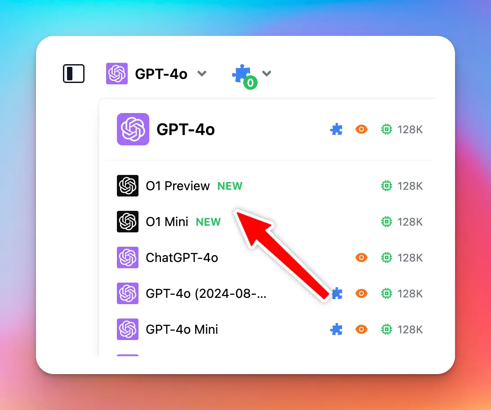

🧩 The new OpenAI models O1 Preview and O1 Mini are now available on [typingmind.com](http://typingmind.com/) 🔥

## 🔥 What’s New?

- New OpenAI o1-preview and o1-mini models focus on enhanced reasoning capabilities, allowing them to tackle more complex problems in science, math, and coding.
- o1-preview excels in deep reasoning tasks, while o1-mini is faster and more cost-effective, particularly for coding, being 80% cheaper.
- Both models are useful for developers and researchers needing accurate multi-step workflows or debugging, with o1-mini targeting scenarios requiring reasoning but not extensive world knowledge.
- Please note that the two new models do not support plugins

### ❓ Note

If you are using these models via Custom Models, make sure to untick the **"Streaming Output"** and **"System Role"** when adding the model, as these new models do not support those two features.

### 📌 Stay updated

Follow us on [Twitter](https://x.com/TypingMindApp) to stay informed about the latest updates, tips, and tutorials: 

[https://twitter.com/TypingMindApp/status/1834440294785257486](https://twitter.com/TypingMindApp/status/1834440294785257486)