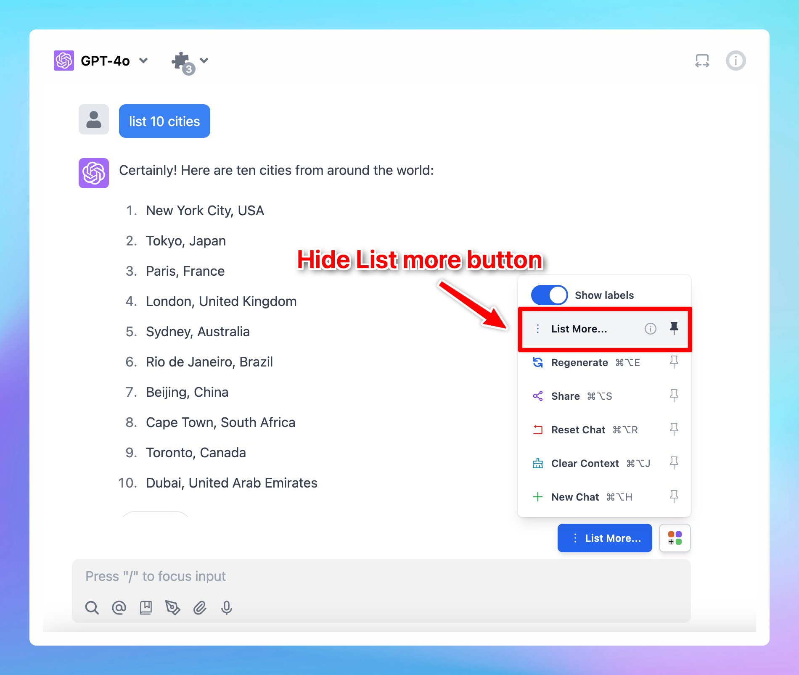

# Option to hide List More button

## 🔥 What’s News?

We have just added an option to hide List more button. Please note that this option only appears if the AI response includes a list of items.

<aside>
💡

For TypingMind Custom users, you can also turn this off via the Admin Panel → Chat Features.

</aside>

## **🏁 How it works**

1. Ask the AI assistant to give a list of anything you want.
2. The List more button appears → Click on the Square icon next to it and unpin List More option.

## 📌 Stay updated

Follow us on [Twitter](https://x.com/TypingMindApp) to stay informed about the latest updates, tips, and tutorials: 

[https://x.com/TypingMindApp/status/1851836497458045400](https://x.com/TypingMindApp/status/1851836497458045400)