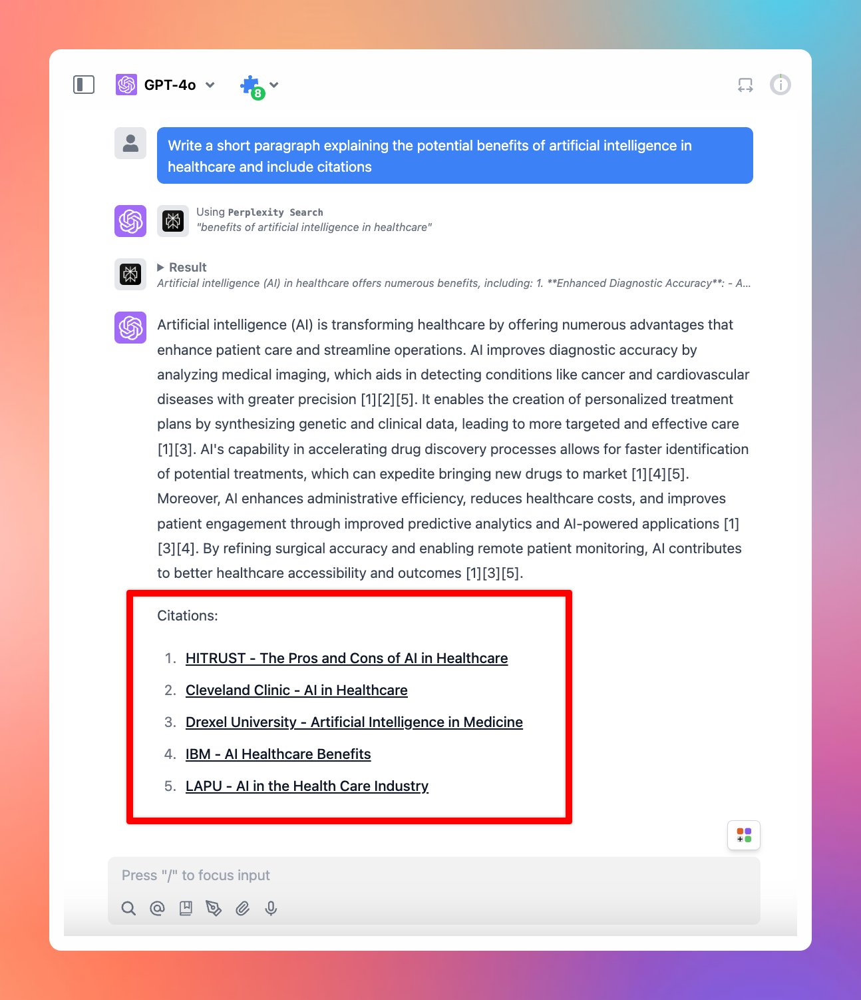

# Perplexity Search Plugin now supports citations!

Perplexity Search Plugin on TypingMind now supports citations - which provides sources of information that the AI model generates within the response, ensuring more accurate and relevant answers.

## ⚙️ How it works?

To get it to work, you just need to enable Perplexity Search Plugin and provide relevant prompts that help trigger the plugin.

<aside>
💡

Include “Perplexity Search”, “citations” keywords in your prompt to ensure the AI model trigger the right plugin and generate responses with citations.

</aside>

https://docs.typingmind.com/plugins/set-up-perplexity-search

## 📌 Stay updated

Follow us on [Twitter](https://x.com/TypingMindApp) to stay informed about the latest updates, tips, and tutorials.

[https://x.com/TypingMindApp/status/1856577736707379439](https://x.com/TypingMindApp/status/1856577736707379439)