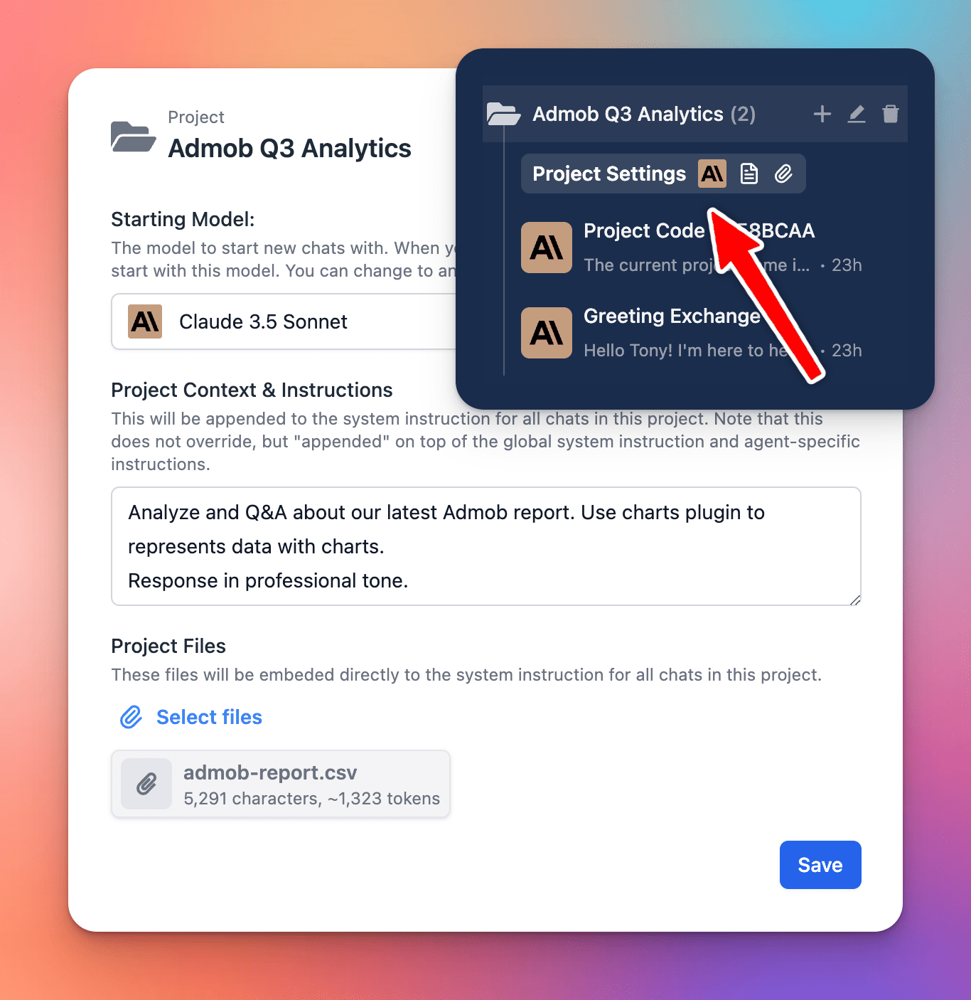

# Project Folders

We have just released the **Project Folders** for TypingMind to help you manage and organize your work much more easily.

## 🔥 What’s News?

Project Folders are an improved version of the old “Folders” feature. This is built to help you better organize your projects by giving you a dedicated space to:

- Assign a specific AI model to each project.
- Add custom system instructions.
- Upload relevant documents directly to the project.

The new Project Folders allow every chat or task within a project has the right context and resources available.

## **🏁 How it works**

1. Navigate your left sidebar and click on “+” icon to create a project folder
2. Click on Project Settings to:
    - Assign a chat model for your project
    - Provide context and custom instructions
    - Upload training files (if any)

Learn more: https://docs.typingmind.com/chat-management/project-folders

### 📌 Stay updated

Follow us on [Twitter](https://x.com/TypingMindApp) to stay informed about the latest updates, tips, and tutorials: 

[https://x.com/TypingMindApp/status/1850940598217552246](https://x.com/TypingMindApp/status/1850940598217552246)