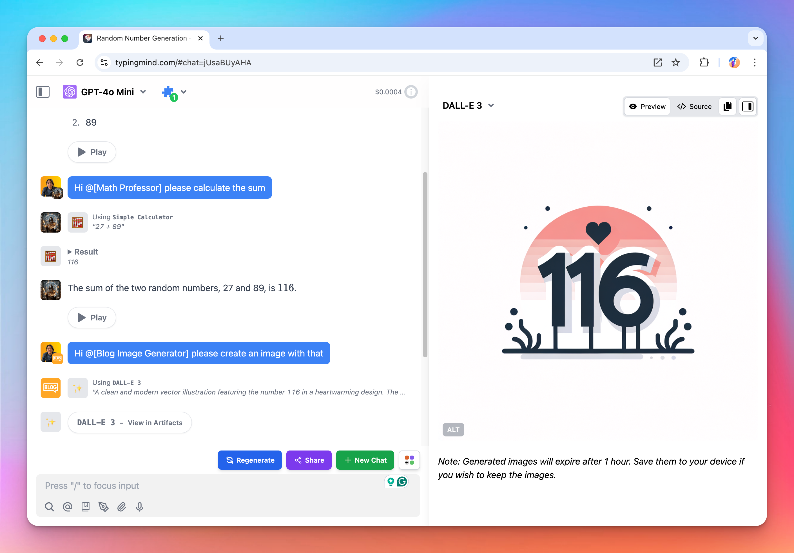

🧩 TypingMind now allows you to create "flows" that involve multi-step, multi-agents in a single conversation to achieve a specific task.

### **🚀 What's New?**

- You can create multi-step prompt chains that tag multiple AI agents into the flow. (With each agent can have their own model, parameters, dynamic context, system prompt, plugins, etc., and have access to all previous messages in the current conversation.
- Save your flows as text in your prompt library for easy access and reuse (use slash "/" to call a prompt in the text input)
- This works in regular messages too, not just prompts, just type @ in your input and call up any AI agent in any conversation.

### **🏁 How it works**

👉 Here is some examples on how to use the “flows”:

> output two random number
> 
> 
> Hi @[Math Professor] please calculate the sum
> 
> Hi @[Blog Image Generator] please create an image with that
> 

Find out more about **Prompt Chaining** here: https://docs.typingmind.com/prompts/prompt-chaining-automated-workflow-to-enhance-model-reasoning

### 📌 Stay updated

Follow us on [Twitter](https://x.com/TypingMindApp) to stay informed about the latest updates, tips, and tutorials: 

[https://x.com/TypingMindApp/status/1838163342063784310](https://x.com/TypingMindApp/status/1838163342063784310)