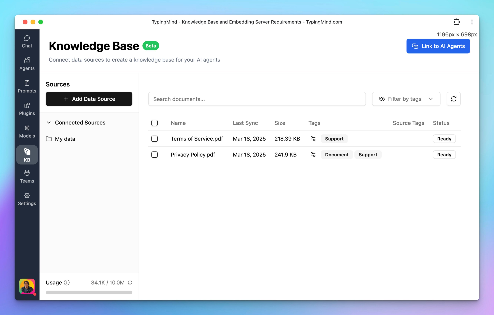

## 🔥 What’s new?

🎉Good news: RAG is now available on TypingMind natively!

Previously, you need to set up RAG using plugins or dynamic context.

But now, it's as simple as uploading a file—built-in, seamless, and available to everyone (Beta)!

Try it out, and let us know what you think! 👉 [http://typingmind.com](http://typingmind.com/)

## 📌 Stay updated

Follow us on [X](https://x.com/TypingMindApp), [LinkedIn](https://www.linkedin.com/company/typingmind/), [Facebook](https://www.facebook.com/typingmind), [Instagram](https://www.instagram.com/typingmind_app/) to stay informed about the latest updates, tips, and tutorials.

[https://x.com/TypingMindApp/status/1902006304484540753](https://x.com/TypingMindApp/status/1902006304484540753)