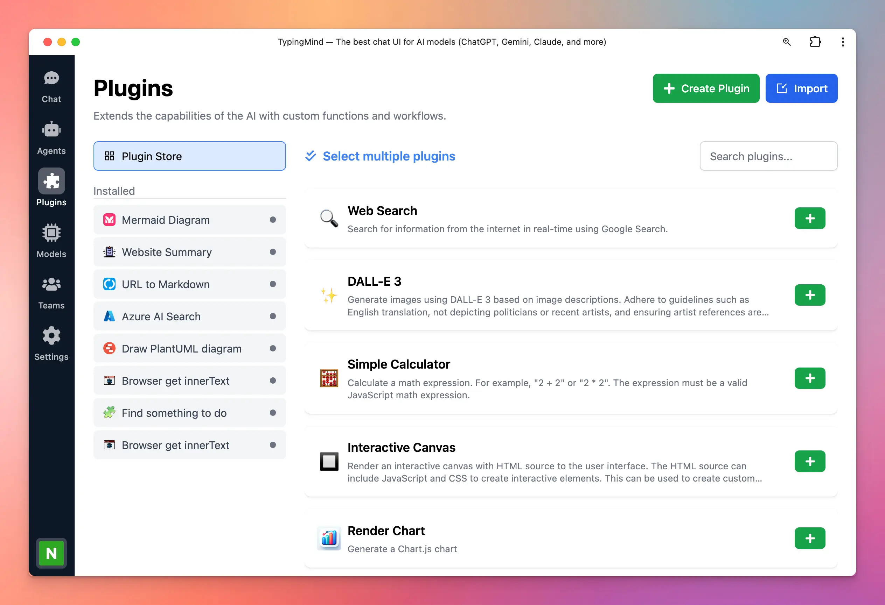

Improve UX / UI for our plugin setting page!

## 🔥 What’s News?

- New Plugin Store to browse plugins more easily
- Quickly install multiple plugins
- Search to find plugins faster
- Duplicate, share, edit or uninstall plugin with ease
- Improved UX/UI for a more intuitive and streamlined experience

### **🏁 How it works**

- Go to Plugin **settings** on the left side panel to see the new updates.

### 📌 Stay updated

Follow us on [Twitter](https://x.com/TypingMindApp) to stay informed about the latest updates, tips, and tutorials: 

[https://x.com/TypingMindApp/status/1843706762941345870](https://x.com/TypingMindApp/status/1843706762941345870)