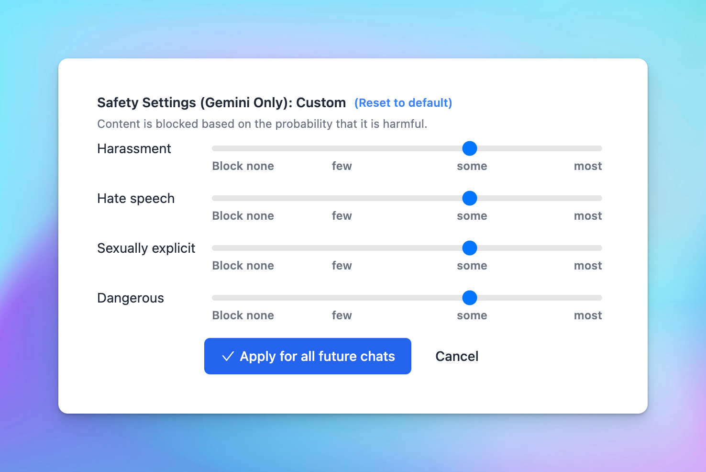

🧩 Now you can configure the Safety settings for Gemini models on [typingmind.com](http://typingmind.com/)!

### **🚀 What's New?**

Now you can configure the Safety settings for Gemini models on [typingmind.com](http://typingmind.com/)!

The Gemini API provides safety settings that you can adjust during the prototyping stage to determine if your application requires more or less restrictive safety configuration. You can adjust these settings across four filter categories to restrict or allow certain types of content.

### ⚙️ **How does it work?**

In TypingMind: Go to Model Settings > Expand the Advanced Model Parameters > Adjust Safety settings

### ✨ Stay updated

Follow us on [Twitter](https://x.com/TypingMindApp) to stay informed about the latest updates, tips, and tutorials: 

[https://twitter.com/TypingMindApp/status/1793124877882314759](https://twitter.com/TypingMindApp/status/1793124877882314759)