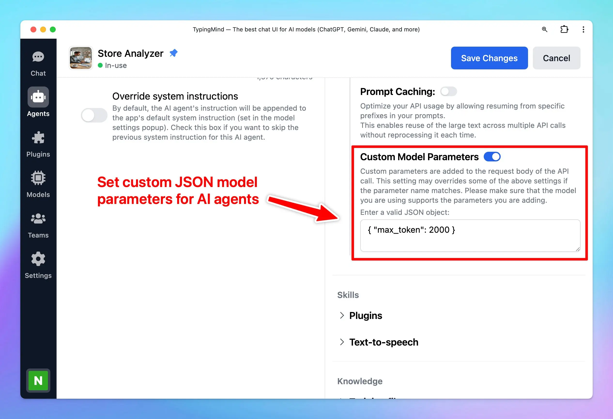

Now you can set up Custom JSON model parameters for AI Agents!

## **🚀 What's New?**

This allows you to set up custom parameters that are not available in the app.

- Custom parameters are added to the request body of the API call
- This setting may overrides some of the available parameter settings if the parameter name matches.
- Make sure that the model you are using supports the parameters you are adding

For example:  to set up max tokens for AI Agent using Azure OpenAI, use: `{ "max_tokens": 2000 }`

## ✨ Stay updated

Follow us on [Twitter](https://x.com/TypingMindApp) to stay informed about the latest updates, tips, and tutorials: 

[https://x.com/TypingMindApp/status/1844390294344933811](https://x.com/TypingMindApp/status/1844390294344933811)