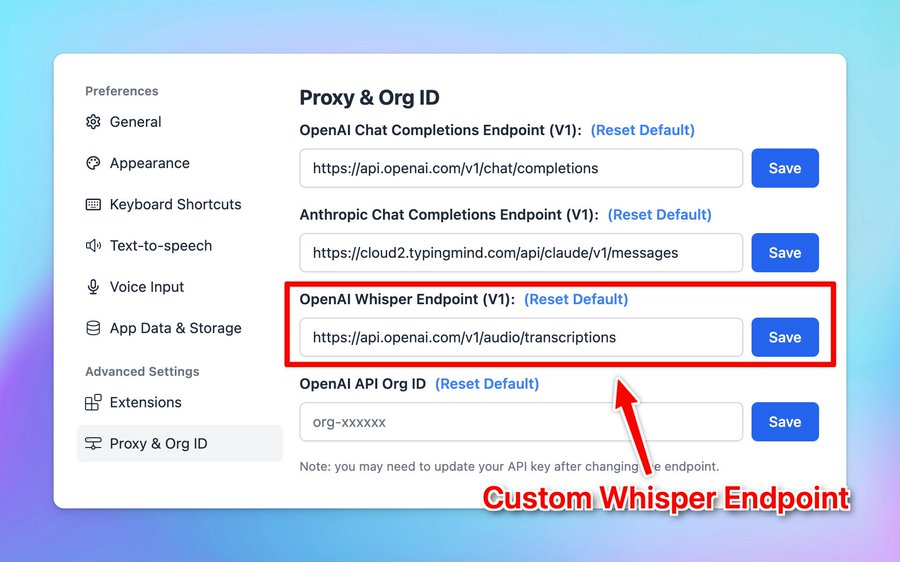

# Set up Local Whisper

Set your local Whisper endpoint for voice input on [http://typingmind.com](http://typingmind.com/)!

## **🏁 How it works**

- Go to Settings
- Select Proxy & Org ID
- Change the OpenAI Whisper Endpoint to your local endpoint.

## ✨ Stay updated

Follow us on [Twitter](https://x.com/TypingMindApp) to stay informed about the latest updates, tips, and tutorials: 

[https://x.com/TypingMindApp/status/1825745893997555862](https://x.com/TypingMindApp/status/1825745893997555862)