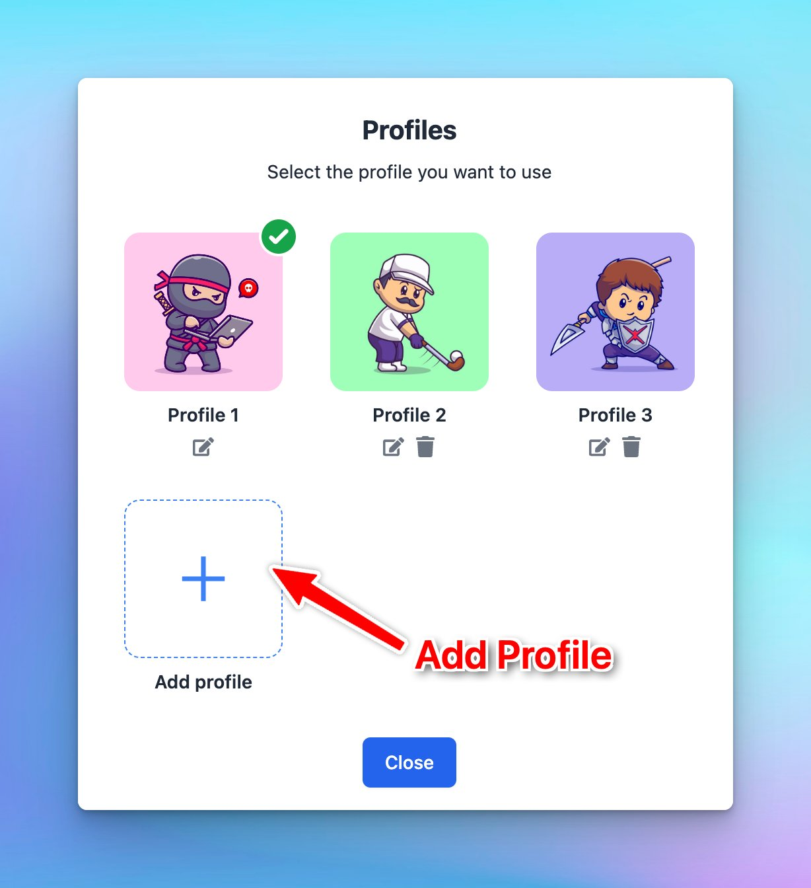

# Set up Multiple Profiles

## **🚀 What's New?**

Set up Multiple Profiles on TypingMind:

- Create different profiles, each with its own context & instructions.
- Assign API keys to each profile.

Ex: easily switch between profiles for:

- Personal projects and hobbies
- Work-related tasks

## ⚙️ How it works?

On the top left corner of the app, click Profile to set up your profiles.

## ✨ Stay updated

Follow us on [Twitter](https://x.com/TypingMindApp) to stay informed about the latest updates, tips, and tutorials: 

[https://twitter.com/TypingMindApp/status/1767939826865910135](https://twitter.com/TypingMindApp/status/1767939826865910135)