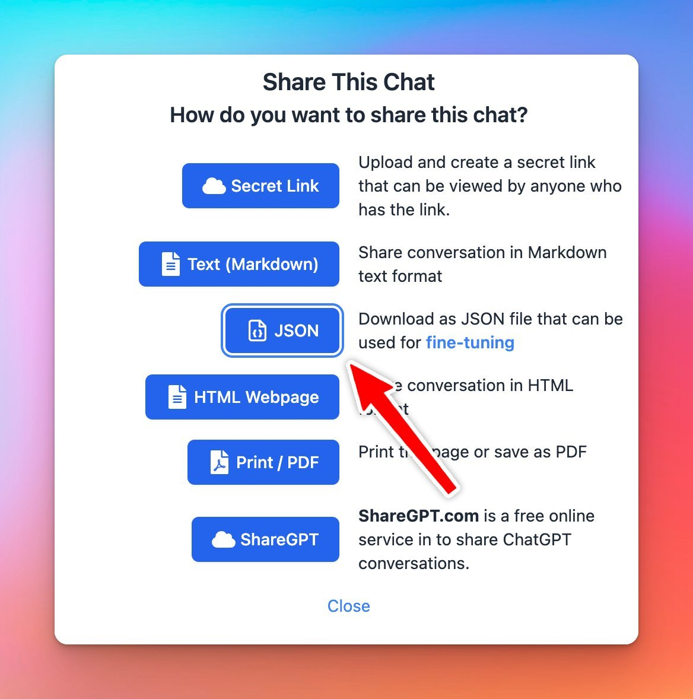

## **🚀 What's New?**

As OpenAI now supports fine-tuning...

TypingMind now allows you to share chat messages in JSON format that can be used directly as the fine-tuning input.

## ✨ Stay updated

Follow us on [Twitter](https://x.com/TypingMindApp) to stay informed about the latest updates, tips, and tutorials: 

[https://x.com/TypingMindApp/status/1694879077679944050](https://x.com/TypingMindApp/status/1694879077679944050)