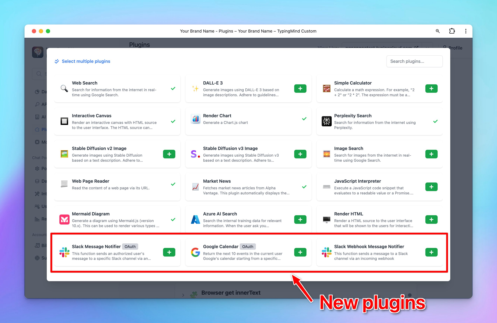

# Three new plugins!

## **🚀 What's New?**

Our Plugin Store just got more powerful!

We’ve added 3 new plugins:

🔸[Slack Message Notifier (OAuth)](https://docs.typingmind.com/plugins/tutorial:-slack-message-notifier-plugin-with-oauth-2.0): with this plugin, you can send messages from TypingMind to a Slack channel once you authenticate with your Slack account.

🔸[Slack Webhook Message Notifier](https://api.slack.com/messaging/webhooks): this plugin also helps send messages to a Slack channel using an incoming webhook.

🔸[Google Calendar (OAuth)](https://docs.typingmind.com/plugins/tutorial:-google-calendar-plugin-with-oauth-2.0): this allows the AI to access the user’s calendar via Google API.

## ✨ Stay updated

Follow us on [Twitter](https://x.com/TypingMindApp) to stay informed about the latest updates, tips, and tutorials: 

[https://x.com/TypingMindApp/status/1846578347339612667](https://x.com/TypingMindApp/status/1846578347339612667)