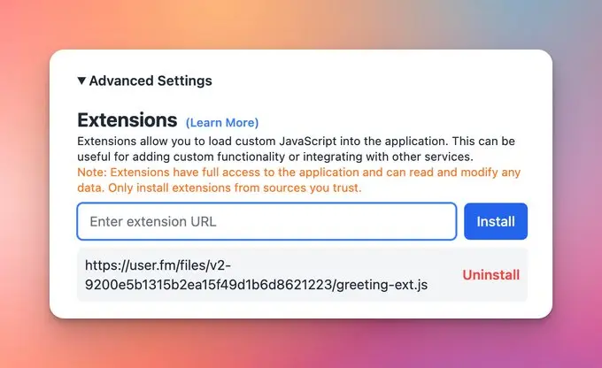

TypingMind Extension is an advanced feature for developers to expand Typing Mind functionality by loading custom scripts to the app.

## ⚙️ How it works?

You can use this to:

- Access your Typing Mind's data and build a private Cloud Sync server (instead of using Typing Mind's default Cloud Sync)
- Add custom features to the app
- Customize the App UI

### ✨ Stay updated

Follow us on [Twitter](https://x.com/TypingMindApp) to stay informed about the latest updates, tips, and tutorials: 

[https://twitter.com/tdinh_me/status/1768805050552598702](https://twitter.com/tdinh_me/status/1768805050552598702)