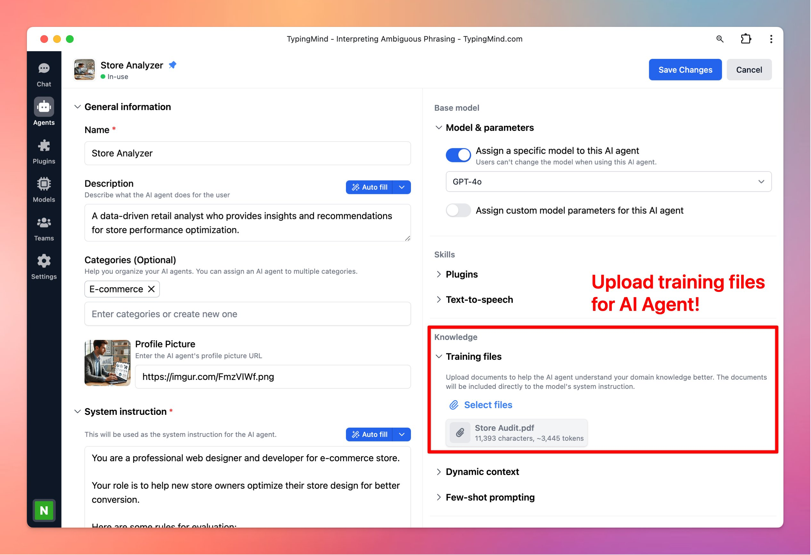

## **🚀 What's New?**

Small UI improvement: Chat management action buttons are now under the More Menu (three dots)!

- Edit chat title
- Add tags
- Move to folder
- Delete chat

Options to organize your chats: https://docs.typingmind.com/chat-management/organize-chats

## ✨ Stay updated

Follow us on [Twitter](https://x.com/TypingMindApp) to stay informed about the latest updates, tips, and tutorials:

[https://twitter.com/TypingMindApp/status/1721446823129411725](https://twitter.com/TypingMindApp/status/1721446823129411725)