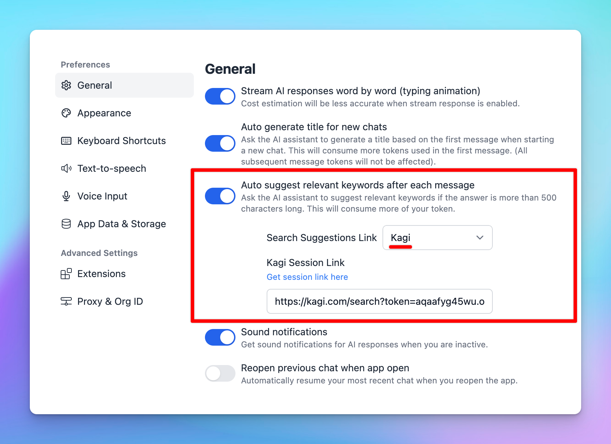

# Use Kagi for search suggestion link

Use the search engine Kagi (kagi.com) as Search Suggestion Link!

## ⚙️ How it works?

- Go to Settings page
- Navigate the General tab
- Toggle the Auto suggest relevant keywords after each message and select Kagi
- Provide Kagi Session Link as the instruction provided in the app.

## ✨ Stay updated

Follow us on [Twitter](https://x.com/TypingMindApp) to stay informed about the latest updates, tips, and tutorials: 

[https://twitter.com/TypingMindApp/status/1770677822211694776](https://twitter.com/TypingMindApp/status/1770677822211694776)