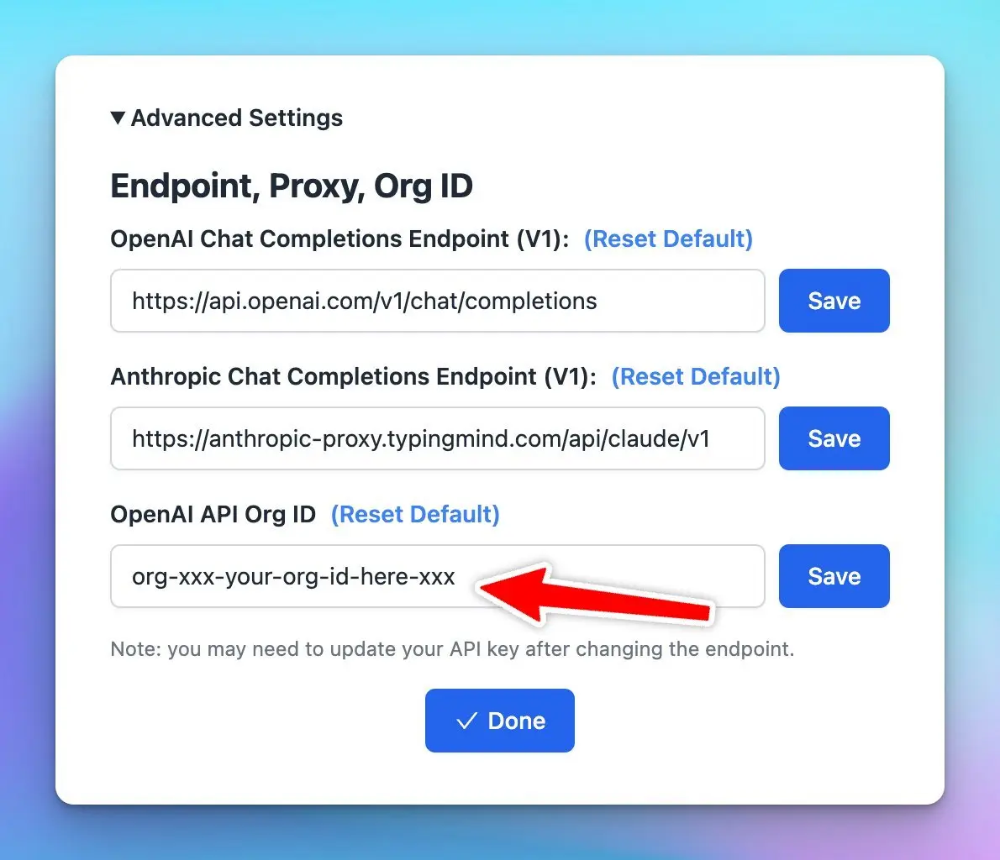

### **🚀 What's New?**

If your OpenAI API key is tied to an organization, you can configure TypingMind to use that Org ID.

Go to Setting (the gear ⚙️ icon) → Advanced Settings → OpenAI API Org ID.

### ✨ Stay updated

Follow us on [Twitter](https://x.com/TypingMindApp) to stay informed about the latest updates, tips, and tutorials: 

[https://twitter.com/TypingMindApp/status/1670714786953441281](https://twitter.com/TypingMindApp/status/1670714786953441281)