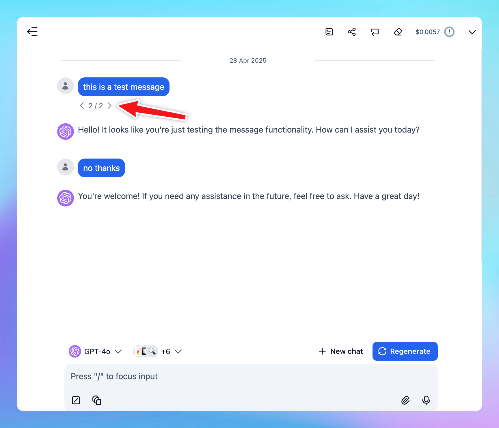

## What Is the Chat Thread Feature?

**Chat Thread** allows you to view, switch between, and continue chatting with multiple versions of your current chat session.

When you regenerate or edit a message, the app preserves the original conversation along with the new prompt and response, creating a separate thread for each version.

You can easily switch back and forth among versions, view each message thread independently, and continue the conversation based on any version you choose.

More than that, you can start a new thread at any point in the conversation. This uses all previous conversation history as context up to that point, and the new thread’s flow will be saved independently from the original path.

## Why Uses Chat Threads?

- **Preserve all your ideas**: every time you edit or regenerate, you don't lose the earlier versions — they stay linked to their own prompt version that you make changes.
- **Explore different directions**: try different prompts to test your ideas without losing track of where you started.
- **Compare versions easily**: review how the AI response changes with different prompts or re-generations.
- **Flexible continuation**: choose any version to keep chatting from — perfect for branching conversations or trying alternate solutions.
- **Better organization**: manage complex conversations more neatly without cluttering your main thread.

## Common Use Cases

- **Content writing**: explore multiple storylines, email, report, marketing copies version as you change your prompt from the same starting idea.
- **Problem solving**: test different problem-solving approaches to compare easily.
- **Learning and research**: see how rephrasing a question changes the answer quality or direction.
- **Decision making**: compare different options or plans you brainstorm with AI models.
- **Coding:** regenerate code solutions with slight prompt changes and compare efficiency or style.

[https://vimeo.com/1079446637?share=copy#t=0](https://vimeo.com/1079446637?share=copy#t=0)

## How to Use Chat Threads

1. **Edit or Regenerate a message**
    - Click on a message you want to **edit** or choose **regenerate** if you want a new take.
    - The system automatically saves the **new version** while keeping the **original**.
2. **Navigate among versions**
    - After editing or regenerating, you'll see **arrow buttons** (← and →) right below the message you make changes.
    - Click the arrows to move back and forth between different versions.
    - Each version is linked to its specific prompt and conversation flow.
3. **Continue chatting from any version**
    - After switching to a version you prefer, just **continue chatting** normally — your new messages will branch from that version.
4. **View threads independently**
    - Each thread acts as a mini-conversation.
    - You can explore different conversation paths without confusion.

[https://vimeo.com/1079442707?share=copy#t=0](https://vimeo.com/1079442707?share=copy#t=0)

> Pro Tip:
> 
> 
> You can always return to any earlier version by clicking the left arrow (←), even if you've gone many steps ahead on a different branch.
> 

## FAQs

**Q: Does editing delete the original message?**

A: No. Editing creates a new version while keeping the original intact.

**Q: Can I continue conversations from different versions?**

A: Yes! Each version is fully interactive and independent.

**Q: How many versions can I have?**

A: There is no strict limit for most users, but very old branches may be archived if inactive for long periods.