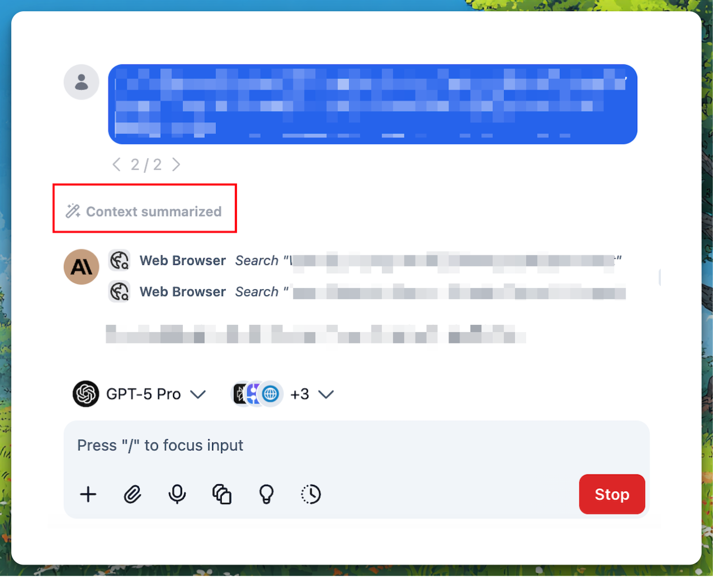
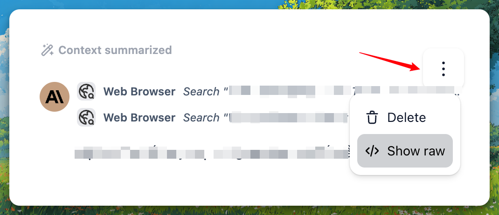

## **What Is the Context Summary Feature?**

**Context Summary** allows TypingMind to automatically condense older messages in long conversations so the chat stays within your model's context limit.

You can choose whether to see the summary checkpoints in the chat, and (depending on your setup) customize the summarization prompt to control how the summary is generated.

# **How Context Summary Works**

1. **Automatic trigger**: When the conversation uses about 70% of the model's context window, TypingMind checks if summarization is needed.

2. **Summary generation**: The AI creates a structured summary of the older messages (roughly the first 70% of the conversation).

3. **Context replacement**: The summary replaces the older messages in the context sent to the model. Recent messages stay as-is.

4. **Checkpoint display**: If enabled, a "Context summarized" checkpoint appears in the chat where the summary was inserted.

<aside>
💡 **Pro Tip:** You can expand the "Context summarized" checkpoint to read the full summary and verify what the AI remembered from the earlier conversation. You can also customize the summarization prompt in settings to tailor the summary to your needs.

</aside>

## **Individual Version**

*Note: If you're on a team or organization instance, Context Summary is controlled by your admin. See the Team Version section below.*

### **How to Enable Context Summary**

1. Open **Settings** (gear icon in the sidebar).

2. Go to **Internal prompts** under Advanced Settings.

3. Turn on **Auto summarize long conversations**.

4. (Optional) Expand **Advanced Settings** to customize the summarization prompt.

### **How to Customize the Summary Prompt**

1. In **Settings** → **Internal prompts**, ensure **Auto summarize long conversations** is on.

2. Expand **Advanced Settings** under that toggle.

3. Edit the text to change how the AI summarizes conversations.

4. Click **Reset to default** to restore the built-in prompt.

## **Team Version**

### **Enabling Context Summary for Your Team**

1. Go to **Admin Panel** → **Chat Features**.

2. Enable **Context Summary** to allow automatic summarization for your organization.

3. (Optional) Enable **Show Context Summary Checkpoints** so users see where summaries were inserted.

4. When **Context Summary** is enabled, expand the **Advanced Settings** to set a custom **Context Summary Prompt** for your chat instance.

### **Context Summary vs. Show Context Summary**

| **Setting** | **What it does** |
| --- | --- |
| **Context Summary** | Turns automatic summarization on or off. When off, long chats may hit context limits.  |
| **Show Context Summary Checkpoints** | Controls whether users see the "Context summarized" message in the chat. Summarization still runs in the background when enabled; this only affects the UI. 
 |

### **Defaults for Team Version**

- **Context Summary**: On by default.
- **Show Context Summary Checkpoints**: Off by default (users don't see the checkpoint, but summarization still happens).

## **User Experience in Team Version**

- Users do not configure Context Summary themselves; it is controlled by admins.
- If **Context Summary** is enabled, long conversations are automatically summarized.
- If **Show Context Summary Checkpoints** is enabled, users see the "Context summarized" checkpoint and can expand it to read the summary.

## **FAQs**

- **Does context summarization delete my messages?**

No. Your full message history stays in the chat. Summarization only affects what is sent to the model as context. The summary replaces older messages in that context so the conversation can continue within the model's limit.

- **When does summarization happen?**

When the conversation uses about 70% of the model's context window and Context Summary is enabled. It runs automatically during the normal chat flow.

- **Can I turn off context summarization?**

Yes. In the individual version: **Settings** → **Internal prompts** → turn off **Auto summarize long conversations**. In the team version: your admin can disable **Context Summary** in **Chat Features**.

- **What if I hide the "Context summarized" checkpoint?**

Summarization still runs when needed. Hiding the checkpoint only affects the UI; the model still receives the summarized context.

- **Can I customize what gets summarized?**

You can customize the summarization prompt. In the individual version: **Settings** → **Internal prompts** → **Advanced Settings**. In the team version: your admin can set a custom prompt in **Chat Features** when Context Summary is enabled.

- **Does summarization use extra tokens?**

Yes. Creating the summary uses one non-streaming AI call. The summary itself is usually shorter than the original messages, so later messages in the conversation use fewer tokens overall.

- **What model is used for context summarization?**

The same model you're chatting with. If you're using GPT-5.2, the summary is generated by GPT-5.2; if you're using Claude 4.6 Opus, it's Claude 4.6 Opus, and so on.