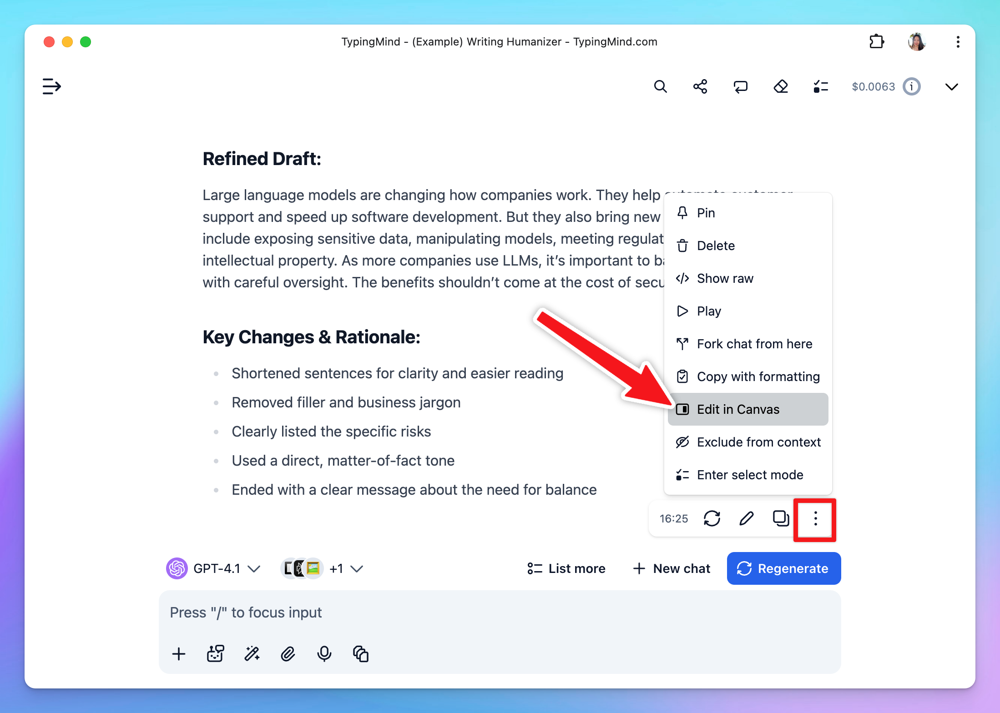

**TypingMind Edit in Canvas** is here to streamline your workflow by allowing you to directly refine responses in a dedicated canvas, especially when you need to edit, collaborate, or review your work. 

One interesting thing with Edit in Canvas on TypingMind that you can work with your favorite AI models, not just ChatGPT, but also with Claude 3.5 Sonnet, Gemini 1.5 Pro 002, and more! 

Let’s explore the details.

<aside>
💡

Please note that this feature is only available for Premium license. 

</aside>

## What can you do with Edit in Canvas?

**Edit in Canvas on TypingMind** is great for editing and revising the AI response to improve AI-generated responses that meet your goals without switching back-and-forth within your conversation.

Edit in Canvas can make your work smoother and more effective by allowing you to:

- **Edit text or code directly**: make changes instantly, add or adjust your text or code.
- **Rewrite specific parts of your text or the entire message**: make your text longer, shorter, friendlier or enter custom prompts to adjust tone, voice, style of your text.
- **Use markdown formatting**: you update basic styles for your text including bold, italics, headers, lists, quotes, and more.

## Why use Edit in Canvas on TypingMind?

- TypingMind’s Edit in Canvas is **available regardless of response length**. This means you can start refining even the shortest responses without any restrictions.
- It **works seamlessly with a variety of AI models**, so you’re not limited to one option. Whether you’re using ChatGPT, Claude, Gemini, or others, you can easily tailor responses to meet your specific needs.

*Please note: Edits apply only to the AI-generated response, providing you with a dedicated space to make adjustments without affecting the original conversation flow.*

## Accessing Edit in Canvas on TypingMind

Collaboration is key with Edit in Canvas on TypingMind:

- You can pick an AI model and start a conversation to work on your project.
- When you receive an AI response, hover over it, click on the three-dot icon and select "Edit in Canvas."
- Clicking "Edit in Canvas" opens a window on the right where you can easily see and edit the response.

### **1. Edit or add text directly**

Make quick changes or add new content within Canvas. 

You can add a new paragraph, tweak a sentence directly without leaving the Canvas. 

[edit text.mp4](Edit%20in%20Canvas/edit_text.mp4)

### **2. Rewrite text**

You can use our prompt shortcuts - such as “make it shorter”, “make it longer”, “make it friendlier”, etc. to adjust the text.

Or you can enter your own prompt to modify the tone, length, or style of the AI-generated content. You have the flexibility to adjust specific portions of text or the entire message.

[rewrite.mp4](Edit%20in%20Canvas/rewrite.mp4)

### **3. Markdown formatting**

Update your text with proper formats including bold, italics, headers, and lists to make your text look clean and organized.

[format.mp4](Edit%20in%20Canvas/format.mp4)

## Use cases for using Edit in Canvas

### 1. Help with writing tasks

Edit in Canvas makes your writing tasks easy and efficient:

- Modify your social posts, for example, to get more emoji or bullet points
- Refine blog articles for publication
- Develop project proposals from your basic ideas

### 2. Simplify complex texts

Edit in Canvas allows you to simplify dense articles, technical documents, or research papers by adjusting the reading level within the AI-generated text to suit different needs.

- Adjust to make a simplified versions of technical documents, ideal for readers who need an overview without advanced terminology.
- Make challenging subjects more understandable by asking the AI model to break down complex language.
- Improve comprehension of scientific or legal texts

## FAQs

**Q: Does the rewrite function of the canvas use the context of the whole conversation, the message in canvas or just the highlighted part?**

A: The rewrite function uses the context of the whole conversation (all previous messages), along with the highlighted part to rewrite.

**Q: Does it use the same model the main chat is talking with?**

A: Yes!

**Q: Are there any restrictions regarding the number of lines or words when using Edit in Canvas?**

A: There are no restrictions! Simply ask the AI assistant to get the response and edit it in Canvas, regardless of its length.

**Q: What is the max length for Edit in Canvas?**

A: There’s no max length for Canvas, the limit will depend on the maximum context length of your AI model. 

**Q: Is Edit in Canvas same as Artifacts?**

A: No, the Edit in Canvas feature allows you to edit and modify parts of your AI-generated content or code directly in a dedicated canvas while Artifacts helps you generate specific types of content that require structured display or interaction, such as code snippets, documents, or data visualizations.