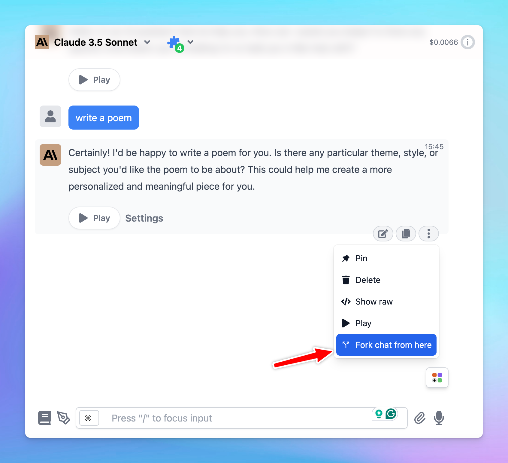

Forking a chat in our app allows you to create a new conversation branch from any specific point in an existing conversation. 

This is particularly useful for exploring different ideas, testing various prompts, or organizing complex discussions with the current context being kept.

# How to Fork Chats on TypingMind

- Go to the chat you want to fork.
- Identify the specific point of message from which you want to start the fork. This can be any message in the conversation.
- **Access the Fork Option**:
    - Click on the **three-dot menu** next to the message you’ve selected.
    - From the dropdown menu, select **Fork chat from here**.
- A new conversation will be created so you can continue the conversation with the old context.

<aside>
💡 This forked chat will include all the relevant context up to that point, allowing you to explore new directions or ideas without altering the original conversation.

</aside>

# Benefits of Forking a Chat

- **Focused discussions:** allow you to zero in on a specific topic or idea without interrupting the main conversation flow.
- **Experimentation**: test different scenarios or prompts in parallel by creating multiple forks from the same conversation point.
- **Organization**: keep your thoughts and discussions organized, especially in long or complex conversations.

<aside>
💡 If you want to start a thread right within a conversation, this is not available yet, we are actively working on this!

</aside>