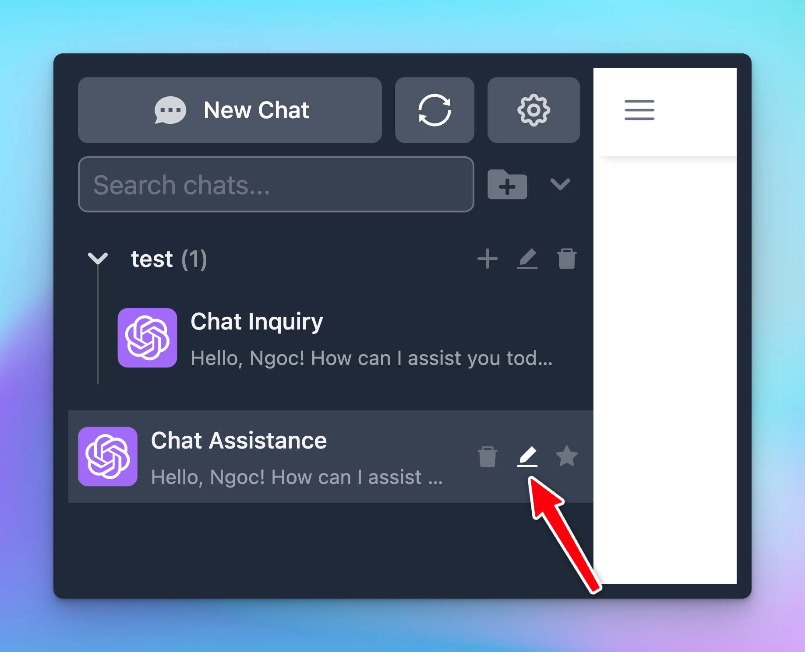
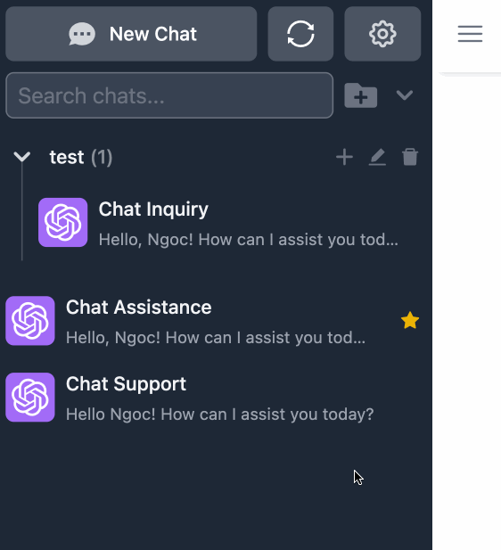
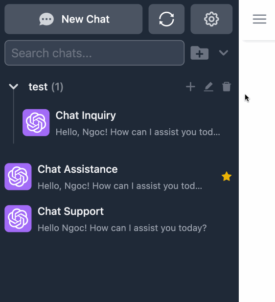

# Organize chats

TypingMind allows you to manage your chat history easily. An organized workspace will promote an enhanced productivity and streamline workflow. Here’s how you can organize the chats with TypingMind:

## **1. Update the chat title**

TypingMind will automatically generate a title for each new conversation related to its content to help you keep track of them.

However, you can easily customize this by clicking the “**pen**” **icon** next to each title on the left sidebar

## **2. Pin chats**

You can pin important conversations so they always stay at the top of your chat list.

To pin the chats, easily click the **“star” icon** next to each conversation on the left sidebar.

## **3. Add chats to folders**

To keep your chats organized, you may want to add them to specific folders.

<aside>
💡

You can now manage folders as different projects with its own settings, learn more: 

[Project Folders](Project%20Folders%20a95fbc7ad192418c969f9271b404a635.md)

</aside>

- First, **create a new folder** by clicking **“folder icon"** on the left sidebar.
    
    
    
- **Name your folder**
    
    
    
- You can then **drag and drop** any chat into the folder or select the chat and choose the option "**Move**" to move the a specific folder you want.
    
    
    
    Drag to folder
    
    
    
    Select chats
    

You can also create a new chat directly in the folder by clicking the “+” icon!

## 4. Add tags to your chats

You can categorize your chat by assigning them specific tags.

[add tags to chats (1).mp4](Organize%20chats/add_tags_to_chats_(1).mp4)

## 5. Archive chats

Archive chats to reduce chat clutter on your chat list:

This option can be done automatically as follows:

- Go to app Settings on the left side panel —> General
- Enable “Auto archive old chats” and select a specific timeframe you want to archive the chat. For example, if you select 24 hours, chat created more than 24 hours will be archived
- You have the option the “Auto delete archived chats”, chats that are archived more than a specific time frame will be automatically deleted.

## **6. Delete chats**

Easily delete conversation: click the **“Trash icon”** next to each conversation on the left sidebar to delete one by one.

## 7. Bulk actions

- Bulk delete chats
- Bulk archive chats
- Move multiple chats into a folder

[bulk action (1).mp4](Organize%20chats/bulk_action_(1).mp4)

<aside>
💡 Pro tip: Use Shift + Click to select multiple consecutive chats:

1. Select one chat
2. Hold down Shift + click on another chat further down in the chat list
3. All chats in between the first and second selected items are also selected.

This allows you to quickly delete/archive/move to folder multiple chats at once.

</aside>