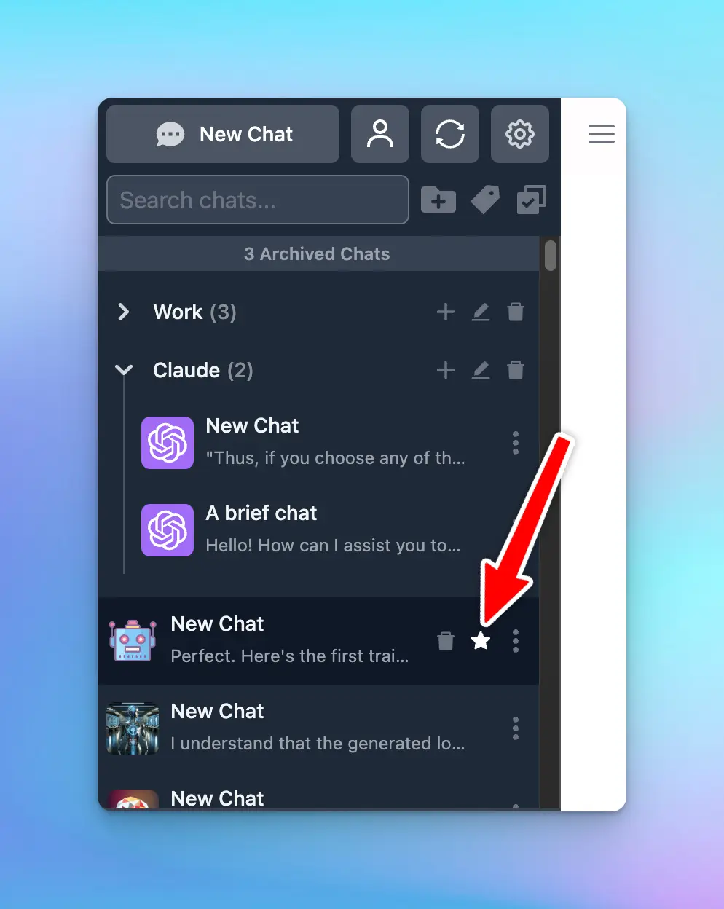

You can pin important messages or conversations on [TypingMind.com](http://TypingMind.com) for later use or reference.

## Pin a conversation

You can pin an entire conversation to the top of your chat list so you can find it easier for future reference.

- Hover to a chat
- Click the star icon

## Pin a specific message within a conversation

If you like any specific AI outputs and want to save them later for reference, you can pin the specific messages in a chat:

- Hover the specific message and click the three dots
- Click “Pin” to pin that message.

You can find the pinned messages on the top right corner of the chat by clicking on the “Pin” icon.

