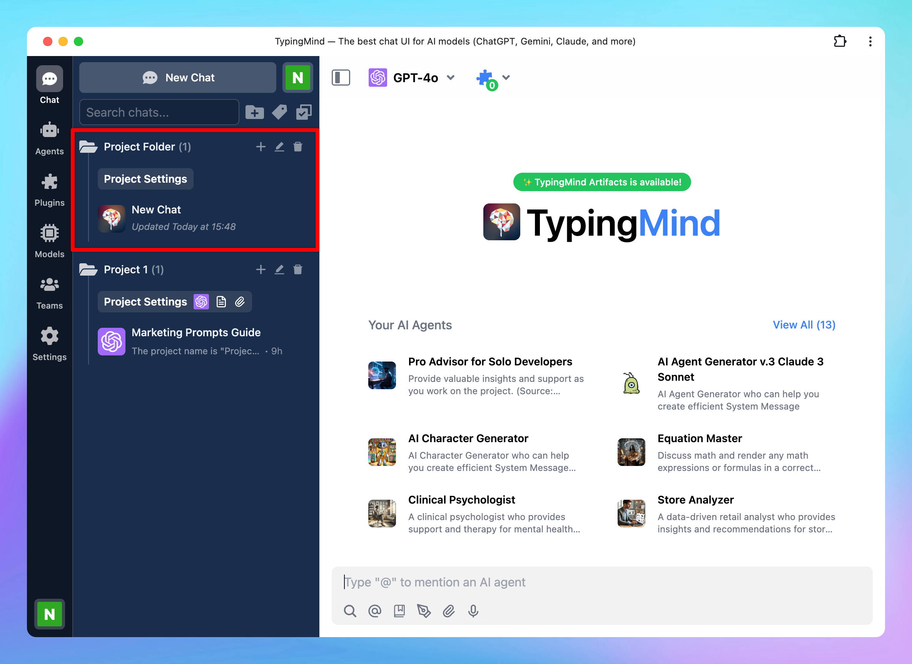

We have just released the **Project Folders** for TypingMind to help you manage and organize your work much more easily.

Let’s dive into the details!

## What are Project Folders?

Project Folders are an improved version of the old “Folders” feature. This is built to help you better organize your projects by giving you a dedicated space to:

- Assign a specific AI model or AI agent to each project.
- Add custom system instructions.
- Upload relevant documents directly to the project or connect with your data sources using [Dynamic Context](../AI%20Agents/Dynamic%20Context%20via%20API%20fc22e689952b47999aeef080cde44caf.md).

The new Project Folders allow every chat or task within a project has the right context and resources available.

## What can Project Folders do?

Project Folder creates a central hub for chat activities related to a specific task. Here’s what it can do for you:

- **Select a specific model for your Project:** you can select an AI model for each project. When you start a new chat in this project, it will automatically use the model you assigned. You can adjust the model as your project progresses.
- **Select a default AI Agent**: you can assign an AI Agent to your Project Folder! Once you assign an AI Agent, new chats within that project will start with the selected AI agent.
- **Provide context and instructions:** this let you set guidelines for the AI within that project, defining things like tone, response style, or focus areas. These instructions apply only within the project and won’t interfere with the global system settings, which allows you to refine the AI’s behavior to fit the unique requirements of each project.
- **Build persistent memory for your project by uploading training documents**: upload essential documents, like reports, datasets, or style guides, directly into each Project Folder. These files are embedded into the project’s system instructions.
- **Connect with your data sources using [Dynamic Context](../AI%20Agents/Dynamic%20Context%20via%20API%20fc22e689952b47999aeef080cde44caf.md):** retrieve content from an API and inject it into the system prompt. This can be used to add live information to the AI or implement Retrieval-Augmented Generation (RAG) from your own data sources (e.g., vector store database).

Therefore, for every new chat within the same project, they will have the knowledge that you have set for the entire project.

## How to use Project Folders on TypingMind

### Step 1: Create a Project Folder

To start using a Project Folder:

1. Navigate your left sidebar and click on “+” icon to create a project 
2. Give your folder a name and enter to save

### Step 2: Set up your Project

Once you’re in the Project Folder, you’ll see option “**Project Settings**” - click on it customize your project. 

Here’s what you can do:

- **Assign a specific model**: select the starting model that will be used for all new chats within this project. You can change to another model manually anytime.
- **Choose a default AI Agent:** every new conversation within your project will use the AI Agent that you have set for the project. This allows you to boost your productivity by allowing you to start a conversation with AI Agent effortlessly without taking extra steps.
- **Provide context and instructions**: this instruction will be appended to the [system instruction](../System%20Prompt/System%20Instruction%208226727031644d9992d16e2b2225c923.md) for all chats in this project. Note that this does not override, but "appended" on top of the global system instruction and agent-specific instructions.
- **Upload documents**: use the “Select files” button to upload any files relevant to the project. These documents will be embedded into the system instructions and accessible in all chats within your created project.
- **Use Dynamic Context:** click on Add endpoint to connect with your data sources and help the AI model retrieve content from it. Here’s how to use [Dynamic Context](../AI%20Agents/Dynamic%20Context%20via%20API%20fc22e689952b47999aeef080cde44caf.md).

### Step 3: Start a new chat in your Project

Once your Project Folder is set up, starting a new chat is easy:

1. Find the Project Folder in your sidebar.
2. Click the **plus button (“+”)** next to the project name.
3. A new chat will open, already configured with the model, instructions, and resources you’ve set up for the project.

## Example use cases for Project Folders

### Coding support

Use a Project Folder to organize all coding tasks in one place.

Upload relevant files like API documentation, technical specs, or debugging logs, which allows the AI to reference these resources while helping you troubleshoot, optimize, or explain complex coding concepts.

### Personal project

For hobbies or personal goals like organizing a garden or photo collection, create a Project Folder to centralize plans, schedules, and resources.

Upload guides, templates, or progress photos. The AI can then use these documents to provide personalized advice, set reminders, or offer creative ideas based on the project’s content.

### Story writing

Set up a Project Folder to support your writing process, organizing story outlines, character bios, and theme notes. 

Upload draft chapters, or style guides so the AI can access these resources to help develop plotlines, refine dialogue, or maintain a consistent tone across your work.