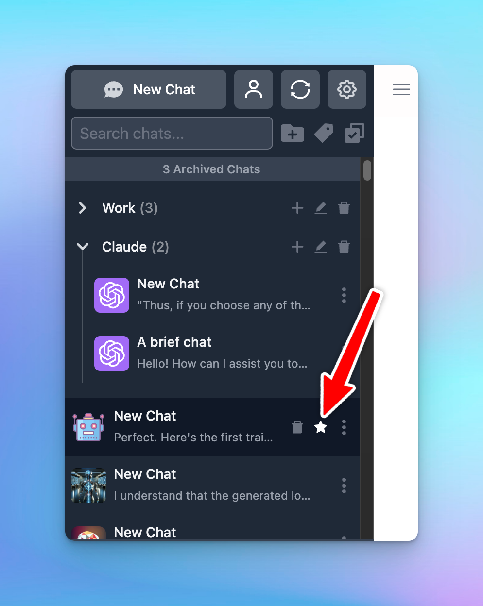

# Share/Export chats

Have a cool conversation and want to:

- Share it with your friends and your community?
- Export it for later reference?

**TypingMind sharing/exporting chat feature** allows you to share/export a specific chat with different formats such as:

- A unique link
- PDF
- Markdown
- JSON
- HTML

## How to use the sharing/exporting chat feature on TypingMind

1. Click on **New Chat** and start a conversation
2. Right above the message area, click “**Share**” button

1. Choose your **expected sharing/exporting format**:
    - Unique link via Secret Link (TypingMind Cloud) or ShareGPT
    - Text, HTML, PDF
    - JSON (used to build fine-tuning model)

1. If you share your chat via a unique link, just simply copy the link and share with everyone!

If you share with other formats, just copy and download the file based on different formats.

