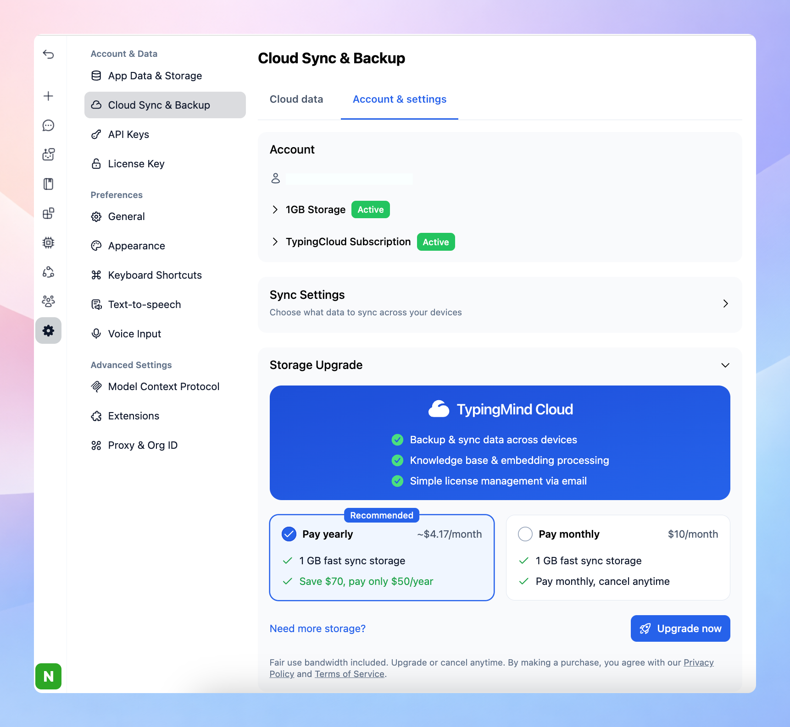

By default, you will have 50MB of free cloud storage (typically enough for 5000 chats).

If you find that your default cloud storage is not sufficient, you have the options to upgrade your storage capacity.

## Upgrade Your Cloud Storage

- Go to Settings → Cloud sync & Backup
- Switch to **Account & Settings tab**
- Toggle Storage Upgrade and Choose a storage plan

We offer two additional storage plans: 1GB and 5GB. You can choose to pay monthly or annually.

## Best practices to save Cloud Storage

- To make the most of your cloud storage, regularly remove old or unnecessary chats and files. This helps free up space for newer and more relevant data. You can review what is using your storage by going to **Settings → Cloud Sync & Backup → Stored Data**.

- Although we've estimated the number of chats these storage amounts can handle, the actual number can vary based on the extent of the content in your chats. Always monitor your usage and adjust your plan as necessary.

If you need further assistance, please feel free to reach out to our support team.