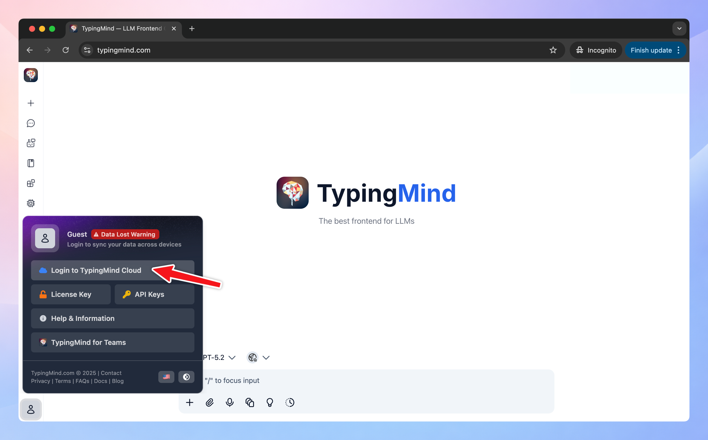

## What is Cloud Sync & Backup on TypingMind?

**TypingMind Cloud** is an **opt-in only** service we provide to help you conveniently:

- Sync your data across devices
- Share your data with friends via a link that is publicly accessible from the internet.
- Backup your lost data

By default, you will have 50MB of free cloud storage (typically enough for 5000 chats). If you find that your default cloud storage is not sufficient, you have the options to upgrade your storage capacity.

<Note>
  **Using TypingMind Cloud is completely optional.**

  If you don’t sign in with your email, all of your data will be stored locally on your device, and you can continue using the app with full functionality as usual.
</Note>

## Enable Cloud Sync

To **enable Cloud Sync and Backup**, you can simply click on your Profile (on the bottom left corner of the app) → Log into TypingMind Cloud with your email.

You can log into your cloud account using passkey, go to Settings → Cloud Sync & Backup → Switch to Account & Settings tab → click on three-dot icon next to your email and select Add new passkey.

## How TypingMind Cloud Sync & Backup works?

### 1. Sync your data across devices

If you enable TypingMind Cloud for Sync and Backup, we will store all of the following data to the TypingMind Cloud server:

- Chats
- API Keys and License key
- Prompts
- AI Agents
- Plugins
- Profiles
- Preferences
- Model Settings
- Chat Output Settings
- Keyboard Shortcuts
- Custom Models
- Plugin Settings
- Message Attachments (Images, Files, etc.)

If there’s any data from the above options you prefer not to save, you can choose which data or settings to sync to TypingMind Cloud by using the “Sync Settings” option.

So **as long as you use the same email account for Cloud,** when you make some changes, it's immediately updated across all your devices, no matter where you are or what device you're using.

<Tip>
  You can also uncheck on the settings that you don’t want to sync across devices so when you make changes on one device, it won’t affect the others.
</Tip>

### 2. Share your data via a unique link

Similarly, when you **Share** your data with TypingMind Cloud, we will store the data you shared on our server.

Data can be shared includes:

- Chats
- AI Agents
- Plugins

And it will become publicly available on the internet with a secret link. These links are prevented from being indexed search engines.

<Note>
  Note that you can use other services to share your chat. TypingMind Cloud is just one of the options and is not mandatory.
</Note>

### **3. Recover your deleted data**

When you delete a chat/AI Agents/Prompts/Plugins/Folders, they won’t disappear right away. Instead, they will be moved to **“Recently Deleted”** section in **Cloud Storage** and stay there for **30 days** before being permanently erased.

### 4. Recover your lost data

While Cloud Sync allows you to sync your data across devices, TypingMind Cloud Backup takes a copy of your data and stores them safely in the cloud, ready to be retrieved if the original is lost or damaged.

Click “**Re-sync everything**” or Re log into your Cloud account within Cloud Sync settings in case you lost any of your data while syncing.

## Data privacy

All communication with TypingMind Cloud server are encrypted using HTTPS, all of your data is stored securely on our cloud database provided by AWS and is encrypted at rest.

If you enable TypingMind Cloud for Sync and Backup, we will use Cookie to store your logged in state in order to provide you a seamless sync experience without having to login again. Our cookie will expires after 30 days without any sync activities.

<Note>
  Want to turn off Cloud sync? Click on your Profile on the bottom left of the app and click on the log out logo (next to your email) to sign out.
</Note>