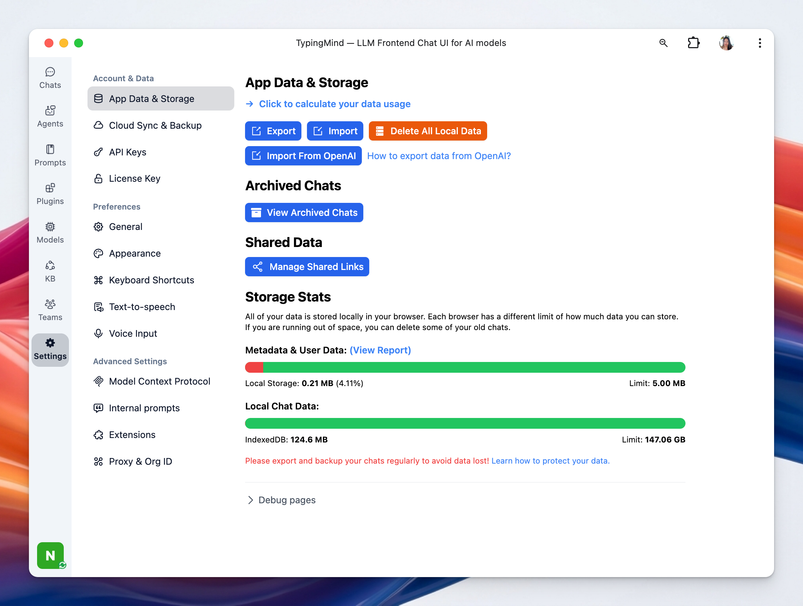

You can easily export / import your data for manual backup. 

- Go to Settings on the left side panel
- Select App data & storage and you will see the Export/Import option right at the top of the page

## **Export your data**

You will have the option to choose which kind of data you would like to export. This might include chats, prompts, plugins, folders, AI Agents, model settings, and more.

- Click “Export”
- Choose the type of data you want to export

Once you've selected the relevant data, click on the “**Download File**” button. The system will then generate a json file that will contain your selected data. 

<aside>
💡

You can also export selected chats:

- Hover to the chat you want to export
- Click on the three dots icon right next to that chat
- Click Export to export that specific chat as JSON

</aside>

## **Importing Your Data**

- Click “**Import**” and choose the json file to import chats to your TypingMind account

<aside>
💡 If you import data from ChatGPT Plus / OpenAI,  please click on Import from OpenAI option.

</aside>

For further assistance with exporting and importing data, or with any other technical issues, please contact our support team.