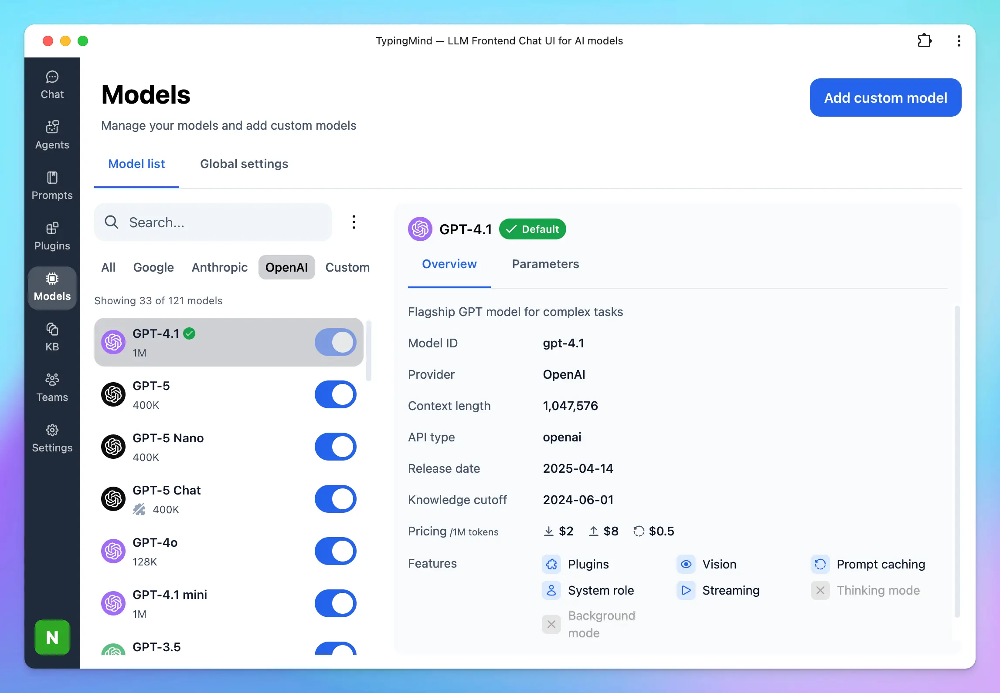
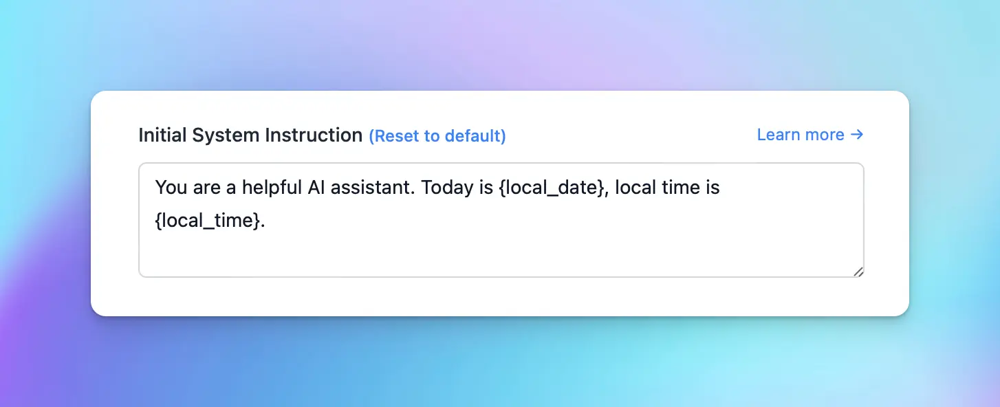

Below are all available features on [TypingMind.com](http://TypingMind.com)

.webp)

## Available AI Models

### 🚀 All ChatGPT Models

Use any OpenAI models (eg: GPT-5, GPT-4.1, GPT-3.5) with your API keys.

### 💥 Claude AI Models

Use Anthropic Claude models such as Claude Sonnet 4.55, Claude Sonnet 3.7, etc.

### 🔍 Google Gemini Models

Use Google Gemini 2.5 Pro, Gemini 2.5 Flash, Nano Banana, etc. on TypingMind!

### 🟢 Use with Custom Models (Open-source LLMs, Local LLMs)

Besides our available models (GPT, Claude, Gemini models), you can also use other open-source or local AI models on TypingMind such as:

- Meta LLaMA
- Mistral AI
- DeepSeek
- Cohere: Command R
- Perplexity
- and more. Find out [here](https://docs.typingmind.com/chat-models-settings)

## Model Configuration

### ⚙️ Custom System Instruction

The system message helps set the behavior of the assistant. You can customize the initial system instruction for the AI model.

### 🎢  Stream Response Control

Decide if the AI should respond all at once (faster) or stream the response word-by-word.

### 🔥 Temperature Control

Configuring the temperature value can make the output more random, or focused and deterministic.

### 💦 Presence Penalty & Frequency Penalty Control

- Frequency\_penalty: discourage the model from repeating the same words or phrases too frequently within the generated text.
- Presence\_penalty: encourage the model to include a diverse range of tokens in the generated text.

### 🌴 Top P

An alternative to sampling with temperature, called nucleus sampling, where the model considers the results of the tokens with top\_p probability mass. So 0.1 means only the tokens comprising the top 10% probability mass are considered.

### 💰 Max Tokens

Limit the maximum number of tokens the AI should generate before stopping.

### ⚡️ Prompt Caching

Prompt Caching allows users to make repeated API calls more efficiently by reusing context from recent prompts, resulting in a reduction in input token costs and faster response times. The Prompt Caching option is now available for Claude, OpenAI and Google Gemini models.

Learn more: [https://docs.typingmind.com/prompts/automatic-prompt-caching](https://docs.typingmind.com/prompts/automatic-prompt-caching)

### 🔗 Custom Endpoint & Proxy

Use TypingMind with your own endpoint or an OpenAI proxy.

## Plugins

### 🧩 TypingMind built-in plugins

TypingMind plugins help enhance the functionality of the AI model, enabling it to perform tasks such as real-time internet searches, image searches, generate images, and more:

- Search: Web Search / Perplexity Search / Web Search via SerpAPI
- Image generation: GPT Image Editor, Dall-E, Stable Diffusion
- Read the content of the provided URL: Firecrawl Web Page Reader
- Automate task: connect with Zapier, Google Calendar, Slack, etc.
- Latest stock news: Market News
- and more [plugins from the community](Plugins/User-contributed%20Plugins%2031b6b3649fcc4397ac0e5f489a90b0f9.md)

### 🏞️ Artifacts

TypingMind Artifacts serves as a dedicated workspace within the app interface where complex, structured outputs such as code snippets, documents, dashboards, and interactive prototypes can be created, edited, and viewed in real time.

### ✏️ Create your own plugins

The possibilities don’t just stop at the TypingMind plugins. Harness the full potential of AI models by adding any plugins you want. Connect with 3rd party system via:

- HTTP action
- Javascript Code
- Model Context Protocol (MCP)

## Chat Experience

### 🤖 Multi-Model Responses

On TypingMind, you can chat with multiple AI models and bring those models to one conversation.

### 🦹 Built-in AI Agents

Specialized AI Agents work as GPT Assistants on ChatGPT Plus with more customization options.

We have more than 60 pre-built AI Agents such as “Stand-up Comedian”, “Backend Software Engineer”, “Academic Researcher”, etc. that can help you answer your questions better.

### 📚 Prompt Library

Manage your own custom prompts, add tags to prompt for easy research or explore the best prompts from the community.

### 📔 Prompt Template & Variables

Easily create sharable prompts with replaceable variables (using the Tab key).

### 📝 Upload Documents or Video

Upload a document or a video (Gemini models only) and ask questions about it.

### 📖 Connect To Your Knowledge Base for RAG

Retrieval-Augmented Generation (RAG) is a technique that enhances Large Language Models (LLMs) by allowing them to access and incorporate external knowledge sources, like databases or documents, to generate more accurate and contextually relevant responses.

TypingMind supports a built-in RAG system with the **Knowledge Base** feature. You can upload files to TypingMind and then allow AI agents to access these files and get more context to answer your questions more accurately during the conversation.

### 💬 Language Output Control

Set default output language, tone, writing style, format, etc.

### ⚡ Multi-conversations in parallel

Hold multiple conversations with ChatGPT at the same time, easily switching between chats while waiting for ChatGPT’s response.

### 🚫 Context Limit

This feature allows you to set the number of messages to include in the context for the AI assistant. When set to 1, the AI assistant will only see and remember the most recent message.

## Integrations

### 💻 PWA

Use TypingMind from your macOS dock by installing it as PWA!

### 💡 Search Keyword Suggestions

Follow up your conversation with search keywords (support Google, Brave, Bing, DuckDuckGo)

### 👩‍💻 CodePen integration

Open code block in CodePen with 1 click!

## User Interface

### 🌙 Beautiful Light/Dark/System Mode

Choose among Light, Dark, or System themes that are most comfortable for your eyes!

### 🖥️ Wide screen support

Make use of your ultra-wide screen when chatting with the AI assistant!

### ⌨️ Hotkey & Shortcuts

Using the right keyboard shortcuts can make your tasks faster and more efficient.

Type / to search for prompts, AI Agents or adjust Output settings:

### 🎙️ Voice Input

Multi-language voice input via microphone.

### 🔊 Text-to-Speech

Multi-language text-to-speech that gives the AI a voice. Supports ElevenLabs API and Browser Native Web Speech API.

### 📲 Mobile friendly support

Chat with your AI assistant on the go!

### 👩‍🎨 Set up Your Profile

Set your own profile with:

- Custom avatar
- API keys
- AI instructions

You can create more than 1 profile.

### 🔊 Sound Notification

A “ding” sound will play when the AI assistant has finished typing (only play when if you navigate away from the app).

## Chat Management

### 🗂️ Projects

Projects are built to help you better organize your projects by giving you a dedicated space to:

- Assign a specific AI model or AI agent to each project.
- Add custom system instructions.
- Upload relevant documents directly to the project.

The new Project Folders allow every chat or task within a project has the right context and resources available.

### 🔍 Chat History Search

Instantly search your previous chats and messages

### 📂 Chat Folders

Just drag and drop chats into folders, create a new chat directly in your folder (\+) or quickly select and move chats (in bulk).

### 🍴 Edit & Fork Conversations

Easily split current conversation into a new chat. Easily edit message or reset the whole chat without starting a new one.

### 🧵 Chat Thread

**Chat Thread** allows you to view, switch between, and continue chatting with multiple versions of your current chat session.

When you regenerate or edit a message, the app preserves the original conversation along with the new prompt and response, creating a separate thread for each version.

### ✍️ Canvas Editor

**Edit in Canvas on TypingMind**

is great for editing and revising the AI response to improve AI-generated responses that meet your goals without switching back-and-forth within your conversation.Edit in Canvas can make your work smoother and more effective by allowing you to:

- **Edit text or code directly**: make changes instantly, add or adjust your text or code.
- **Rewrite specific parts of your text or the entire message**: make your text longer, shorter, friendlier or enter custom prompts to adjust tone, voice, style of your text.
- **Use markdown formatting**: you update basic styles for your text including bold, italics, headers, lists, quotes, and more.

### ⤴️ Share Chat

Share your chat with friends easily with a secret link or export to a PDF/HTML/Text file.

### ✍️ Save Draft

Easily draft long prompts & messages with automatic draft save. Never lose your work again.

### 📌 Pin Favorite Chats

Keep important chats on the top.

### 🏷️ Add Tags to Chats

Add tags to each chat so you can easily categorize and find chats on the same topics quickly.

### ⬇️ Archive chats

Re-organizing your workspace by storing your chats with “Archive”

## Cloud Sync / Backup / Migrate

### 🗄️ Import/Export Chats

Easily import/export your chats to backup your data or share with other people.

### 💽 Migrate from OpenAI ChatGPT

Import your existing chats from OpenAI to TypingMind easily.

### ☁️ Chats Sync & Backup

Sync and backup your chat data across multiple devices.

## TypingMind Extensions

**Typing Mind Extensions** allows users to embed custom JavaScript code into Typing Mind. The JavaScript code will have access to all internal data and application state of Typing Mind, allowing the users to add custom logic and application behavior to fit their workflow.

**Use cases**

- Add additional backup & sync sources (AWS S3, Google Drive, private server, etc.)
- Embed a widget to Typing Mind (e.g., live chat widget)
- Adding custom keyboard shortcuts
- Customize message rendering

## Security and Privacy

### 🔏 Private By Default

No one can see your chat conversations (not even TypingMind’s developer). All chats and prompts data are stored locally.

### 🔐 API Key Encryption with Password

Your API Key is encrypted securely and stored locally on your device.

### 💵 API Tokens and Cost Estimation

Estimate how many tokens are used and how much you consume

### 📦 Self-host Static App

Host the static app on your own private server and domain. Maximum privacy and remove dependent on any hosted service. Available when you buy a license key.

---