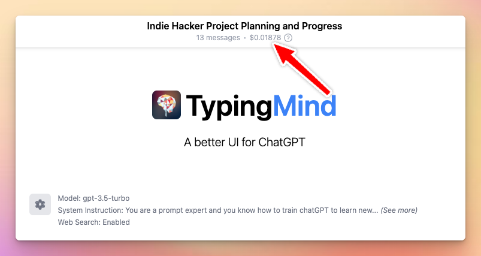

# General FAQs

## 👑 General

### What is TypingMind?

TypingMind provides a better UI for chatGPT. But it’s not limited to the interface only. 

With our app, you will also gain the flexibility to maximize your productivity and elevate your conversational capabilities with:

- Initial system instruction
- Web search & live data
- Prompt library
- AI Agents
- Text-to-speech
- Self-host & PWA
- Better chat management
- Lots of integrations

…. and [more](Feature%20List%2051da062de2764fd4911ccd7cba7fdff7.md)!

Try [TypingMind](https://www.typingmind.com/) now!

### How does this app work?

This is a static web app, it doesn't have any backend server. When you enter your API key, it will be stored locally and securely on your browser. All API requests are sent directly from your browser to OpenAI server to interact with ChatGPT. Think of this as a HTTP client for your ChatGPT API with a lot of convenience features.

### Is this app free?

[TypingMind.com](http://typingmind.com/) is free to use with some basic features. You will need to have a working OpenAI API Key in order to use the app. When you use the API Key, you pay directly to OpenAI for the amount of credits/tokens you use.

[TypingMind.com](http://typingmind.com/) has premium features that can be unlocked with a one-time purchase. 

### What are the premium features?

The premium features include: Chat Search History, Access Prompt Library, Plugins, etc.

.png)

Check out the [feature list](Feature%20List%2051da062de2764fd4911ccd7cba7fdff7.md) and our [pricing page](https://www.typingmind.com/) for more details.

### What are the limitations of the free plans?

In the free plan, chat history will not be saved. You will be present with a popup every few minutes. Some other features may also be limited.

### Do I need to pay for OpenAI?

Yes. You need to have an OpenAI account and a valid API key to use ChatGPT. We don't sell API keys.

### Do I need to pay for ChatGPT Plus ($20/month) to use [TypingMind.com](http://typingmind.com/)?

No! A ChatGPT Plus subscription is not needed. You just need to have an OpenAI's API Key. You can see more info on how to get one here: [https://openai.com/blog/openai-api](https://openai.com/blog/openai-api)

### What's the difference between ChatGPT Plus and ChatGPT API via TypingMind?

Under the hood, ChatGPT Plus and ChatGPT API offer the same model and the same quality. You can view this on their official announcement here: [https://platform.openai.com/docs/guides/chat](https://platform.openai.com/docs/guides/chat). 

The initial system instruction can be a little bit different, which can be configured to make the AI output different messages from time to time.

### I have ChatGPT Plus, will it cost me more to use ChatGPT API via TypingMind?

The ChatGPT API costs soooooo little you won't even notice it. 

Typical chat conversation is about 1000 characters, which costs ~$0.001. That's less than a cent. You can have thousands of chats and it will only costs you like $1. See official pricing here: [https://openai.com/pricing#language-models](https://openai.com/pricing#language-models)

### How do I get support?

You can send an email to [support@typingmind.com](mailto:support@typingmind.com)

Expected response time: **2-3 business days**

---

## ⚙️ Account & Setup

### How to get the OpenAI API Key?

Follow these steps to get the API key:

1. Signup directly with OpenAI at [https://platform.openai.com/signup](https://platform.openai.com/signup) (if you already have an account, you can skip this step)
2. Go to Profile > View API Keys
3. Create a secret key. Then copy the key to fill out in the TypingMind app.

### How is the API key handled?

Your API is safe and stored locally on your device. This is a static app, which means that it doesn't have a backend. All the data is stored in your browser's local storage. Requests to Open AI's API is sent directly from your current browser (check the Network tab in your console if you want to see it).

### How many devices can I use when purchasing TypingMind?

Each license key can be used on 5 devices which is typically enough for 1 user. If you need to use it on for more devices, you can buy a new license keys or add more devices to your existing license key. 

To be more specific, "Device" is counted based on the number of places where the license key is entered and the chat history is saved for continuous use. For example, if you use Typing Mind on Chrome browser on your laptop and also on your phone, that will be 2 devices. 

Note that the license key and chat history is saved locally per browser, so if you use Typing Mind on Chrome and also on Firefox, you will need to enter the license key 2 times, have 2 separate chat histories, and that counts as 2 devices. If you need to use the license key on a new device but have reached the device limit, you can unlink the previous devices first using the License Manager (this is done online, access to the previous devices not needed). This device limit is put in place to avoid license key abuse and pirate.

### How to migrate my chats from OpenAI chat GPT to TypingMind

Go to **App Settings** (the gear icon in the sidebar) > scroll down to **All data** section > click **Import From OpenAI**

### **How to set up my profile picture?**

Just simply go to TypingMind, click to your profile picture and leave an image URL to set up your profile picture.

### **I lost all my chat history. How to recover?**

Your data is typically saved only on your local device storage and not backed up unless you have enabled TypingMind cloud for backup. So if you have not enabled cloud sync before, we would not be able to help you retrieve lost data. 

However, if you have enabled cloud backup, you can easily recover your lost data by navigating to the "Recover lost data" option in the App Settings.

### **Will my chats be saved across devices?**

No, all your chats are saved locally per browser. So if you use Typing Mind on Chrome and also on Firefox, you will need to enter the license key 2 times, have 2 separate chat histories, and that counts as 2 devices. 

If you need to use the license key on a new device but have reached the device limit, you can unlink the previous devices first using the License Manager (License Manager is upcoming feature, now this is done automatically after a short time so access to the previous devices not needed). This device limit is put in place to avoid license key abuse and pirate.

---

## 🗝️ License Manager

### I have purchased but forgot my license key, how can I get it back?

You can go to [https://app.lemonsqueezy.com/my-orders/](https://app.lemonsqueezy.com/my-orders/) to access your license key.

### How do I remove a device from my license? How to access the License Manager?

Check out the [Manage Licenses & Devices](Manage%20License%20&%20Devices%20182d2a8c7a0c4f31883327e2b769eb3b.md) for more details

### **Do I need to re-enter keys whenever I log into another computers?**

Yes, your data is only saved locally per browser. If you use multiple browsers or devices, you will need to enter both your license key and OpenAI API key for each device or browser.

### Is there an expiration date for the License Key?

The license key is valid forever. 

### Will I receive new updates after I buy a license key?

Yes, all future updates are included. Except for some special features that require you to upgrade, for example, the storage package. For any special cases like this, we will announce and update accordingly on our pricing details.

---

## 💰 Refund policy

### Can I get a refund?

Yes. We offer a 14-day money-back guarantee. If you're not satisfied, let us know within 14 days and we'll give you a full refund. Request a refund at [support@typingmind.com](mailto:support@typingmind.com)

---

## 🤖 Usage

### Where can I **see cost estimation or context length of my chats?**

Click to the cost as in the image to switch the display options between cost estimation and context length.

View cost estimation

### What is token? How does it work?

- Token is the total length of your current conversation. It is calculated by OpenAI's API when you send a message.
- When you reach a certain length, you cannot add any more messages to the chat. This is the **context length** limit of the OpenAI's API.
- GPT-3.5 allows maximum of **4,096** tokens per chat. GPT-4 allows maximum of **8,192** tokens per chat in the 8K model and **32,768** tokens in the 32K model. OpenAI may increase the context length limit in the future.
- Some enhanced features on TypingMind will increase your token usage. You can always turn these features off in the Settings panel (click the gear icon in the sidebar). The enhanced features include: Chat Title Suggestion, Search Keywords Suggestions, AI Agents, Upload Document, etc. Amount of tokens used depends on the AI Agent and the length of your document.
- If you reached the context length limit, you can delete some old messages to continue the chat, or start a new chat.

### How’s the cost calculated?

- Cost associated with a chat includes the token cost for the chat messages AND all of the **enhanced features** used for that chat.
- Some enhanced features on TypingMind will increase your token usage. You can always turn these features off in the Settings panel (click the gear icon in the sidebar). The enhanced features include: Chat Title Suggestion, Search Keywords Suggestions, AI Agent, Upload Document, etc. Amount of tokens used depends on the AI Agent and the length of your document.
- All costs are **estimated**, please refer to your [OpenAI dashboard](https://platform.openai.com/account/usage) for the most accurate cost of your API key.
- The cost is calculated based on the [public pricing of OpenAI's API](https://openai.com/pricing). Each model has its own pricing, each type of tokens in each model also has its own pricing.
- Token usages are not recorded when **streaming response** is enabled. We will work on improving this soon.
- [Learn more about OpenAI's model, tokens, and context length here.](https://platform.openai.com/docs/guides/chat)

---

## 💬 AI Chat Models

### **Why GPT-4 keeps saying it’s GPT-3.5?**

It is a well-known fact that the GPT-4 model doesn't know about itself. This is because it has a knowledge cutoff date, and GPT-4 didn't exist when it was trained.

---

## 🔍 Web search

### How Web Search works?

When you enable Web Search, TypingMind will add a short instruction to the OpenAI model to teach the model how to perform a search query using the selected search engine (which is Google by default). The model will then attempt to run a search command only when necessary and use the search result to answer your question.

### How to enable Web Search?

The web search toggle will be appeared when you initiate a new chat. Please follow the instruction in this article to set it up: 

[Web search & Image search](Plugins/Web%20search%20&%20Image%20search%20c85f10f2518e44f4993c02d2d1ebcc4f.md)

### How can the search feature benefit me?

Here are some possible use cases where the web search feature can benefit you such as checking how reliable of your information is with reliable resources on the internet, staying up-to-date with the latest trends, or finding resources / references for a particular topic. 

Those are just the typical use cases for Search feature, you can explore yourself for more amazing use cases.

### **How does TypingMind execute the search?**

TypingMind will use the search engine's API to execute the search query. The search requests are sent directly from your browser to the search API without any intermediate servers. Your privacy is 100% protected. No one can see your search query and search result except you and the search engine itself.

### What search engines are supported?

TypingMind currently only supports Google search engine. We will add more search engines in the future

### What are the limits? How many searches can I do?

The default free plan of Programmable Search Engine includes 100 searches per day for free. If you need more, you may sign up for billing in the Google API Console. [https://cloud.google.com/billing/docs/how-to/manage-billing-account](https://cloud.google.com/billing/docs/how-to/manage-billing-account)

### Does Web Search require GPT-4? Can I use it with GPT-3.5?

Web Search is best used with GPT-4 because it has a larger context length and can store more search results and can pull out information from search result more reliably. However, you can still Web Search with GPT-3.5 without problems (most of the time).

### How much more tokens are used if I enable Web Search?

The base instructions for Web Search contains ~600 tokens. The search result will be added to the context and will be used to answer your question. The more search results you get, the more tokens will be used. The average number of tokens used for Web Search is ~800 tokens.

---

## 📢 Text to speech

### How to enable text-to-speech feature?

There are 2 options to use text-to-speech: Web Speech and ElevenLabs. Please follow the instruction in this article to enable it: 

[Use Text-to-speech ](Text-to-speech/Use%20Text-to-speech%204bd3ff3194dd4dfeb0ed3b5b2fb17d79.md)

### How to get API Key from ElevenLabs?

In the text-to-speech setting panel, choose the ElevenLab Speech API and register via this link: [https://beta.elevenlabs.io/](https://beta.elevenlabs.io/)

---

## 🏠 Self-host

### Can I self-host TypingMind?

Yes. You can install the self-host version at [Self-host Packages](Static%20Self-host/Static%20Self-host%20Package%20&%20Updates%20b30348f60b6a447aa5df88368af096dc.md). Our team will update the latest versions so don’t forget to check out the link more often. 

Note that you will only receive the compiled code of the app, the full source code is not available because the app is not open-source. You can deploy the app anywhere without having to update any code or settings.

### **What is self-hosting?**

Self-host means you deploy the same version of [TypingMind.com](http://typingmind.com/) on your own web hosting server and custom domain name for your personal use.

### **Why self-hosting? What are the benefits?**

Some people prefer to run the software on their own server for privacy and availability reasons. For example, if [TypingMind.com](http://typingmind.com/) becomes inaccessible in the future, you can still access your own version of TypingMind from your server without any problem. The self-host version can also be run locally like an app.

### **Where can I deploy my self-host version?**

Anywhere! You can deploy it on your own server, or on a static web cloud service like GitHub Pages, Cloudflare Pages, AWS S3, Vercel, Netlify, Heroku, etc. You can even run it on localhost.

### How to self-host TypingMind?

Now you can deploy the same version of [TypingMind.com](http://typingmind.com/) on your own web hosting server and domain name for your personal use. Please follow the instructions in the article: 

### What can I customize in the self-host version?

You cannot customize anything. You the self-host version will be the same as the one you are using on [TypingMind.com](http://typingmind.com/). 

### **Why my self-host app doesn’t reflect the latest version?**

The self-host version will be updated later than the static web app. Make sure to check out the latest self-host package [here](Static%20Self-host/Static%20Self-host%20Package%20&%20Updates%20b30348f60b6a447aa5df88368af096dc.md).

### How do I receive updates for the self-host version?

As of now, you will have to manually download the latest version from the website and redeploy your app. New versions can be found as an attachment here 👇

[Static Self-host Package & Updates ](Static%20Self-host/Static%20Self-host%20Package%20&%20Updates%20b30348f60b6a447aa5df88368af096dc.md)

### Do I have access to the full source code if I want to self-host?

No. The license key only grants you permission to use and deploy the app on your own server. You do not have permission to modify or redistribute the code. 

The full source code is not available for sale as the app is not open-source. You will only receive the compiled code of the app, you can deploy the app anywhere without having to update any code or settings.

### **Am I eligible to sell my self-host white label?**

No, you’re not allowed to do so.

### Do I still need a License Key and Open API Key to use the self-hosted version?

Yes. Both are needed, as the self-hosted version is exactly the same as the version you see on [TypingMind.com](http://typingmind.com/). The License Key is needed in the self-host version. When you enter the license key, the app will connect to TypingMind's license server to verify your license.

### Can I let my team/community/customers use the self-host version?

You can, but keep in mind that they will also need a TypingMind License Key and OpenAI API Key in order to use it.

### Can I embed my License Key/API key to the self-host version somehow and let my team/community/customers use it?

No you can't, and you shouldn't. It's not safe to share your License Key and API Key to the public like that. The Static App Self-host version is meant for personal use. If you are looking to setup a custom deployment of TypingMind for your team/community/customers, please check out [https://typingmind.com/custom](https://typingmind.com/custom)

### Can I have support on technical issues if I self-host?

The self-host version comes for free when you buy a license key. There is no support on technical issues if you self-host. If you don't have the technical skills to setup the self-host version, we recommend using the hosted version on [https://typingmind.com](https://typingmind.com/) instead. 

You can also check the TypingMind Custom for easier setup with custom branding and manage team members: [https://typingmind.com/custom](https://typingmind.com/custom) (available as a separate purchase)

### Why don't you offer technical support for the self-hosted version?

There are way too many possible technical issues that could happen with various tech stacks and server configurations that are not in my control. That's why I cannot offer technical support if you have a problem with your self-hosted version.

### What permissions do I have with the self-host code?

- ✅ You have access to the compiled code of the app.
- ✅ You have permission to deploy and use the compiled code on your own server.
- ❌ You do not have permission to modify or redistribute the compiled code.
- ❌ You do not have permission to share or resell the compiled code.

---

## 🌎 Use TypingMind on other platforms

### Is there a MacOS app/Windows/Linux app?

No, but you can add [typingmind.com](http://typingmind.com/) to your home screen. It works exactly like an app!

### Is there an Android/iOS/iPad app?

No, but you can also add [typingmind.com](http://typingmind.com/) to your home screen. It works exactly like an app!

---

## 🚀 TypingMind Team

### What is TypingMind Team?

TypingMind Team is a custom-branded, cloud-hosted version of TypingMind. You can create and customize a Chat instance that works exactly like TypingMind.com under your own domain. You can offer and control the accessibility of the chat interface to your team members, community, or customers.

### What's the difference between TypingMind Team and TypingMind.com?

[TypingMind.com](http://TypingMind.com) provides you with a professional chat interface to help you interact with multiple Large Language Models, and fine-tune the AI outputs with enhanced features. You will need to buy/enter a License Key and API key on your own to use the app.

TypingMind Team is a custom-built version of TypingMind.com, designed for teams, businesses, or communities. It offers an Admin Panel where you can preset the API key and license key (and your users don’t need to do it on their own) and manage almost everything on the UI. 

Here are more details: [https://docs.typingmind.com/getting-started/typingmind-vs-typingmind-custom](https://docs.typingmind.com/getting-started/typingmind-vs-typingmind-custom)

### What is a "Chat instance" or an "instance"?

A "Chat instance" or an "instance" is a chat interface you created when signing up for a Custom Deployment on TypingMind. You can create multiple chat instances for multiple purposes. Each Chat instance is tied to one OpenAI key and runs on one domain.

### What can I do with my chat instance? Which level of control?

You can control almost everything on the chat interface:

- Brand name, tagline, logo, custom domain & theme
- Chat models, AI Agent, Prompts, Plugins, System instructions,…
- Add your training data from multiple sources to create a custom chatbot
- Control the access to your chat interface: private, authorized, public access
- Embed chat widget on your website

And more! Try now: [https://www.typingmind.com/new-deployment](https://www.typingmind.com/new-deployment)

### How to add my own custom domain?

Login to the Admin Panel and go to the Domains section. Add your domain and follow the instructions.

### I've added my custom domain but it's not working

Please check if you've added the correct DNS records. You can find the DNS records in the Domains section of the Admin Panel. If you're still facing issues, please contact us

### Where is the Admin Panel? How do I access it?

The Admin Panel is available at "/admin" of your Chat instance URL. You can also click the link "Admin" in the footer section of your chat UI's the sidebar.

In case you forget the Instance URL, you can login here: [https://www.typingmind.com/custom/manage](https://www.typingmind.com/custom/manage), all of your chat instances will be shown up. 

### How do I add a new user?

Login to the Admin Panel and go to the Members section. Click on the "Add Members" button and fill in the details.

### How many users can I add?

The default subscription comes with 5 users included. You can add more users anytime you want. Pricing listed here: [https://custom.typingmind.com/pricing](https://custom.typingmind.com/pricing)

### How much does this cost?

You can view the pricing details here: [https://custom.typingmind.com/pricing](https://custom.typingmind.com/pricing). You will also need to provide your own Open API key and pay the API usage on your own. To increase the messages limit per month, please contact us.

### Do I need an OpenAI API key to use this?

Yes. After you create a Chat instance, you will need to add the OpenAI API Key in your admin panel. Otherwise, your users cannot chat.

### Do my users need an OpenAI API key to use my chat instance?

No. Your users do not need an OpenAI API key to use your chat instance. They first need your invitation to join the instance.

### How many devices can I use?

You can use up to 5 devices per user.

### How many messages my users can send on my chat instance?

The default subscription comes with 100,000 messages per month per instance. This limit is set to prevent abuse of our proxy server and hurt our bandwidth usage. If you reach this limit, please contact us.

### **Can I limit my user’s usage?**

Yes, you can set a limit message for team members by heading to the Admin panel > Usage & Limit.

### **Can I change my admin email?**

Yes, you can go to the Admin panel, navigate the Instance settings and change your admin email.

### **Will my users see their own token usage and cost estimation?**

Not for now, so sorry. We will work to improve this.

### **How to set up system prompts?**

Go to Admin panel and find the Prompt menu, then Click to Add prompts to set up your prompts. These prompts will be shared across your team members.

### Can **the community prompt go invisible to users?**

Yes, you can hide it from the users. Go to Prompts Library and turn on the option “Allow users to use community prompts”

### **Can I see my user’s chat activities?**

Not for now. The chat will only be saved locally on the user’s browsers / devices. We will make this feature available soon.

### Do my users need to sign up?

No. After you add them to your Members list (in the Admin Panel), they can just login and use your Chat instance. 

### Can I self-host this?

Yes. The option to self-host TypingMind custom is currently available in the [Business Plan](https://custom.typingmind.com/pricing). Please send us a request to **support@typingmind.com**

### Can I remove my users after I added them later?

Yes. You can remove your users from the Members list in the Admin Panel.

### **Can I customize my chat interface?**

Yes, you can customize the chat interface with your brand name, tagline, logo, description. There will be more options to customize in the future.

### **Can I customize the Default System Instruction?**

Yes, you can do it by logging into the Admin Panel and go to Model & Training to set up the system instructions.

### **Can I customize the AI Agents?**

Not for now. We will improve this soon. Make sure you check [https://www.typingmind.com/custom](https://www.typingmind.com/custom) for latest updates. 

### Where are the chats saved?

The chats for each user are saved locally on their devices. There will be an option to enable chat logging that will allow you to view your users' chat messages in the future. So make sure you stay up-to-date by checking [https://www.typingmind.com/custom](https://www.typingmind.com/custom) for the latest updates.

### How to train the chat interface with my own data?

Use the "Model & Training" page in the admin panel to train the AI chat with your data. The training is done by providing the chatbot with an initial system instruction, where you will put all relevant data to give the chatbot a context. More examples on how to train the chatbot is available in the "Model & Training" page in the admin panel

### Can I train the model with my own data from PDF, DOCX, internal docs, etc.?

Yes. Training the model with your own data is currently done via the default system prompt with text input.

### How large is the data we can train the model with?

Training is currently made possible via the system instruction prompt. So the amount of data you can train depends on the context length of the model you have access to. GPT-3.5 has 4,096 tokens context length, GPT-4 has up to 32K tokens of context length. Keep in mind that you'll have to pay for your own OpenAI API usage, the more token used, the more costly it will get. In the future, we will look into utilizing ChatGPT Plugins to enable even more training data and knowledge-base based Q&A.

### Can I track which users use the most token from my OpenAI API key?

Yes, but not yet. We're working on this and will be available soon. Stay tuned!

### Can my users use ChatGPT Plugins in the chat instance?

Not yet, as ChatGPT plugins are not supported in the API. But once OpenAI makes it possible, we'll integrate it in right away.

### I've already bought the Team License (10 Users) or the Team License (50 users) on [TypingMind.com](http://typingmind.com/). Can I use it on my Custom Deployment?

Yes. We allow you to convert your Team License to the Custom Deployment version with the same amount of users. You will still have to pay the fixed subscription cost. Note that after you convert the Team License, the License Key will no longer work on [TypingMind.com](http://typingmind.com/) and your users/team will have to switch to using your chat instance instead. To convert your Team License, please contact us at [support@typingmind.com](mailto:support@typingmind.com).

### Can I use a custom model or a fine-tuned model?

For now, we support all Chat models from OpenAI, including GPT-3.5 and GPT-4. Fine-tune models are not yet supported.

### Can I send emails to my users using my custom domain?

Yes, you can set up a custom email sender with your own domain instead of the default email sent from **hosted@typingmind.com**. Follow the instructions in this article to do so:

### I already have the self-host static app. Can I use it with my Custom Deployment?

No, the self-host static app that comes for free when you buy a license is not intended to be used by team. You can still allow your team members to use it but they'll need to enter their License Key and API Key. With the Custom Deployment, your team members do not have to have a license key and API key to use it.

### Can I allow my users to login via 3rd party services (Google, Facebook, etc.), SSO, or my own OAuth system?

Currently, that's not possible. For now, your users can only login via email.

### Can I allow my users to use their own API Key?

No, that's not the intended use case for Custom Deployment.

### Can I guide the prompts or instruction to be better to certain niche or industry?

Yes. That's doable by customizing the default system instruction and hide it from the users. This feature will be available soon.

### Can I change the user interface to another language (Spanish, French, etc.)?

That's not possible at the moment, but we're looking to add it in soon.

### Where can I find the Terms of Service and Privacy Policy?

Terms of Service: [https://typingmind.com/terms#custom-deployment](https://typingmind.com/terms#custom-deployment) ; Privacy Policy: [https://typingmind.com/privacy#custom-deployment](https://typingmind.com/privacy#custom-deployment)

### **The FAQ Bot is awesome! How can I have it for my website?**

Go to Training Data —> navigate to the System Instruction and click to Example. We have already 

---

## 🔒 Data privacy

### Is it ok to provide OpenAI API Key to TypingMind? Does OpenAI allow this use case? Will you access to my data?

Yes. TypingMind only stores your API Key locally and never sends your API Key anywhere. OpenAI allows use cases where the API key is stored locally in the user's device. You can see this official response from OpenAI's staff here: [https://community.openai.com/t/openais-bring-your-own-key-policy/14538/4](https://community.openai.com/t/openais-bring-your-own-key-policy/14538/4)

### Who can see my search query?

The search requests are sent directly from your browser to the search API without any intermediate servers. Your privacy is 100% protected. No one can see your search query and search result except you and the search engine itself.

### **Is my API Key encrypted in local storage?**

TypingMind offers additional encryption for your API Key. You can enable encryption with a password by clicking the "OpenAI API Key" button in the sidebar and selecting "Encrypt API key...". Your API Key will be encrypted using the AES algorithm provided by the open-source CryptoJS library ([https://github.com/brix/crypto-js](https://github.com/brix/crypto-js)). 

TypingMind only provides an encryption feature for your API key. Chat messages, prompts, AI Agents, and other elements are stored using the standard local storage of your browser, which may or may not include encryption, depending on your browser. The encryption process are done entirely locally on your device, there is no backend server. If you use TypingMind on multiple devices, you will need to encrypt your API key on all of them, you can also set different passwords on different devices.

### What happen if I enable TypingMind cloud? Will my data be public or viewed by anyone?

If you enable TypingMind Cloud for Sync and Backup, we will store all of your chats, prompts, messages, AI Agents, bookmarks to the TypingMind Cloud server. All communication with TypingMind Cloud server are encrypted using HTTPS, all of your data is stored securely on our cloud database provided by [planetscale.com](http://planetscale.com/) and is encrypted at rest. Please check our [Privacy Policy](https://www.typingmind.com/privacy#typingmind-cloud) for more details.

---

## 🔗 Plugins & **Integrations**

### What integrations do you have? How to enable them?

Our integrations include:

- Codepen
- Domain check
- Search keyword suggestions

These integrations are designed to provide assistance seamlessly throughout the conversation. They will be automatically triggered in the conversation once the bot provides relevant answers. 

### What are you available plugins? Can I create my own plugins?

The available plugins on TypingMind are Web search, Image search, Simple Calculator and Javascript Interpreter. 

There are some available plugins created by our community that you can import and use it: [Plugin Examples](Plugins/User-contributed%20Plugins%2031b6b3649fcc4397ac0e5f489a90b0f9.md)

You can also create your plugin that fits your needs.