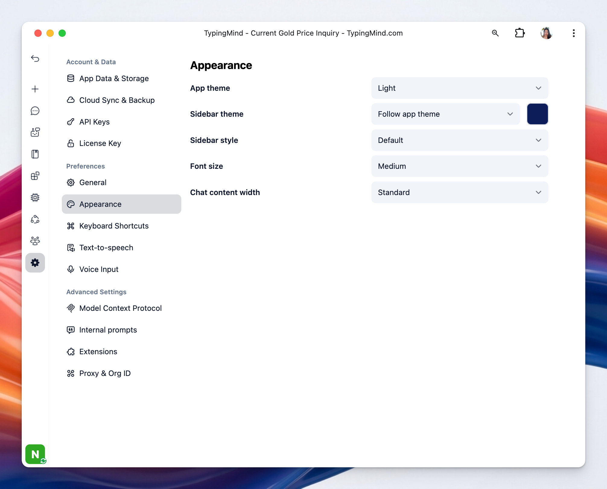

TypingMind allows you to customize how the app interface looks on screen, which controls the visual style of the app, including the overall theme, sidebar appearance, text size, and chat layout width. 

## Access the Appearance settings

- Click on “Settings” on the left sidebar to access the app settings
- Click on the Appearance tab

### **1. App Theme**

This controls the overall visual theme of the application. There are three available themes:

- Dark
- Light
- System (mode applied as your system changes)

For quick access, there’s a theme switcher icon at the bottom left corner of the app. Click it to quickly toggle between themes.

### **2. Sidebar**

This option determines the color theme used specifically for the sidebar. It can follow the main app theme or use a separate appearance for the navigation panel.

- **Theme:** you can select Follow the app theme and set it to be always dark (and set a custom color for your sidebar)

- **Style:** select between the Default style or a more Compact style.

### **3. Font Size**

This option adjusts the size of text shown throughout the interface. It helps improve readability based on your comfort and screen size.