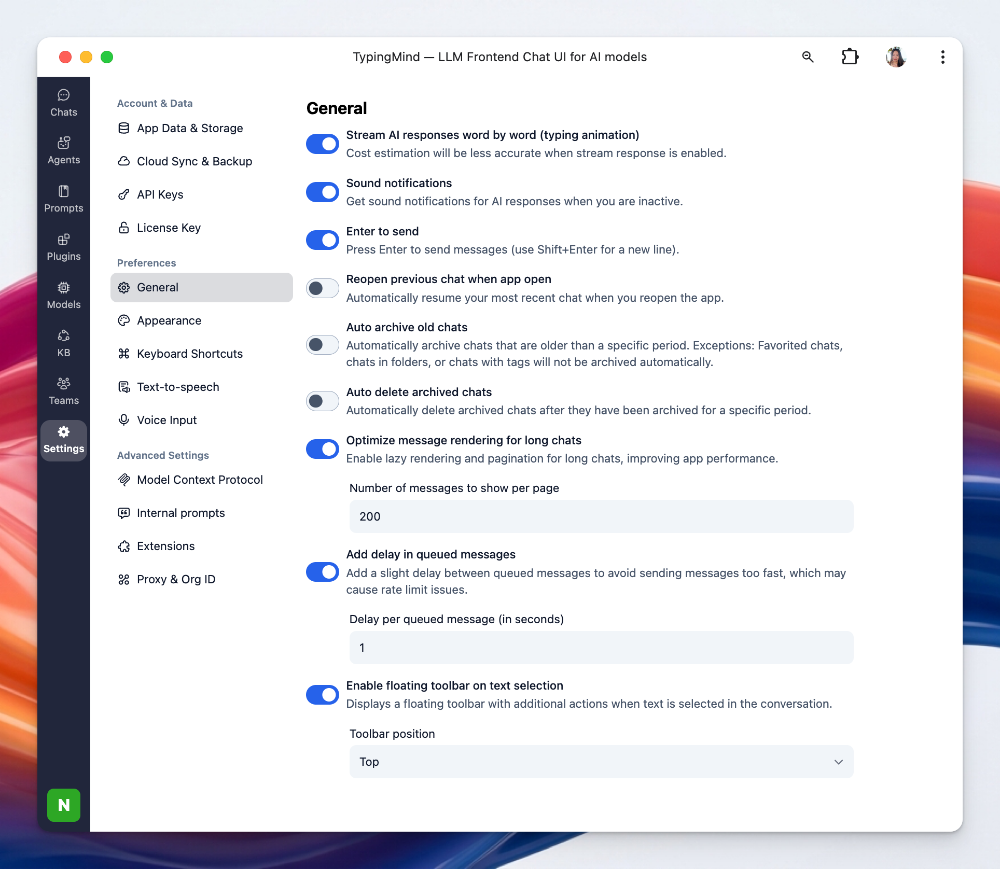

The General Settings allow you to enable or disable various enhanced features within the app to customize your experience.

## Access General Settings

- Click on “Settings” on the left sidebar to access the app settings
- Click on the General tab

## Available options

### **1. Stream AI Responses:**

This option makes AI replies appear gradually, word by word, creating a typing-like effect. It can make the conversation feel more immediate, though cost estimation may be less accurate when it is enabled.

### **2. Sound Notifications:**

This setting plays a sound alert when AI responses arrive while you are inactive. It helps you notice new replies without needing to keep the app in focus.

### **3. Enter to Send:**

With this option enabled, pressing **Enter** sends your message immediately. You can use **Shift+Enter** to insert a new line instead of sending.

You can disable this to use Enter to insert a new line and Cmd + Enter to send the message.

### **4. Reopen Previous Chat When App Open:**

This setting automatically restores your most recent chat when you relaunch the app. It is useful if you want to continue where you left off without manually reopening a conversation.

### **5. Auto Archive Old Chats:**

This option automatically moves chats older than a chosen time period into the archive. Chats in folders, favorited chats, and chats with tags are excluded from automatic archiving.

You can find archived chats by going to Settings → App Data & Storage → View archived chats:

### **6. Auto Delete Archived Chats:**

This setting automatically removes archived chats after they have remained archived for a specified period. It helps keep old conversations from accumulating indefinitely.

### **7. Optimize Message Rendering for Long Chats:**

This option improves performance in long conversations by using lazy rendering and pagination. It helps the app stay responsive when chats contain many messages.

**Number of Messages to Show Per Page: t**his controls how many messages are loaded at a time in long chats. A larger number shows more history per page, while a smaller number can make loading faster.

### **8. Add Delay in Queued Messages:**

This setting adds a small pause between queued messages before they are sent. It helps reduce the chance of sending messages too quickly and running into rate limit issues.

**Delay per Queued Message:** This defines how many seconds to wait between each queued message. A longer delay spaces messages out more.

### **9. Enable Floating Toolbar on Text Selection:**

This option shows a floating toolbar whenever you select text in a conversation. It gives quick access to extra actions without leaving the message view.

