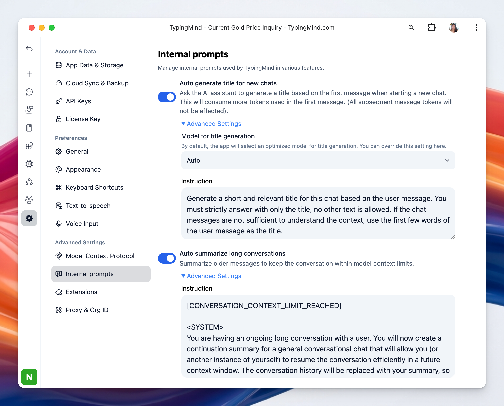

Internal prompts are background instructions that TypingMind sends to the AI for certain built-in features. These prompts are not your normal chat messages. Instead, they control how the app handles tasks like naming chat titles or summarizing long conversations.

Internal prompts allow you to **view and customize the prompts** TypingMind uses internally for automation features.

### **1. Auto generate title for new chats**

This allows the AI to automatically create a title when a new chat starts, usually based on the first user message.

You can:

- **Select specific model for title generation.** If set to **Auto**, TypingMind selects an optimized model for you.
- **Set custom instruction:** this is the prompt that tells the AI how to generate the title. You can customize this so the AI generates title as you prefer.

### **2. Auto summarize long conversations**

This summarizes older parts of a conversation when the chat hits model context limit, which helps keep your conversation within the model’s context window.

You can customize the instruction prompt used for context summary when the conversation reaches the context limit. It tells the AI how to compress earlier messages into a summary while preserving useful context.

### **Why TypingMind exposes this setting**

By allowing you to edit internal prompts, TypingMind gives you more control over how these automated features behave. For example, you could:

- make chat titles shorter or more descriptive
- change the style of summaries
- fine-tune what information gets preserved in long conversations