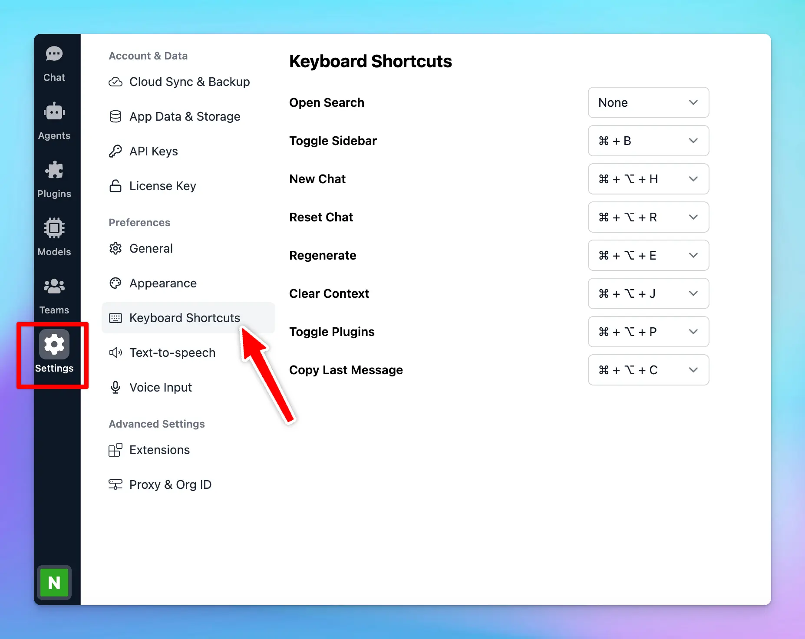

Using the right keyboard shortcuts can make your tasks faster and more efficient. TypingMind provides you with a handful of keyboard shortcut options, which you can easily customize to your preferences.

Let's see how to do that.

## Access Keyboard Shortcuts

- Click on “Settings” on the left sidebar to access the app settings
- Click on the Keyboard Shortcuts tab

## Default Keyboard Shortcuts

Here are the default keyboard shortcuts available in the app, along with their key combinations:

- **Open Search**: press **⌘ \+ K** to quickly open the search function within the app.
- **Toggle Sidebar**: use **⌘ \+ B** to show or hide the sidebar instantly.
- **New Chat**: start a new chat session by pressing **⌘ \+ ⌥ \+ N**.
- **Reset Chat**: reset the current chat and clear the messages by pressing **⌘ \+ ⌥ \+ R**.
- **Regenerate**: use **⌘ \+ ⌥ \+ E** to regenerate the last response from the AI.
- **Clear Context**: press **⌘ \+ ⌥ \+ J** to clear the chat context, which is useful for starting a new topic.
- **Toggle Plugins**: enable or disable plugins quickly using **⌘ \+ ⌥ \+ P**.
- **Copy Last Message**: copy the last message by pressing **⌘ \+ ⌥ \+ C**.

<Tip>
  On Windows, **⌘ \+ ⌥ = Ctrl \+ Alt**

  If you want to modify the default keyboard shortcuts, you can click on the dropdown box of each shortcut to choose your preferred shortkeys.
</Tip>