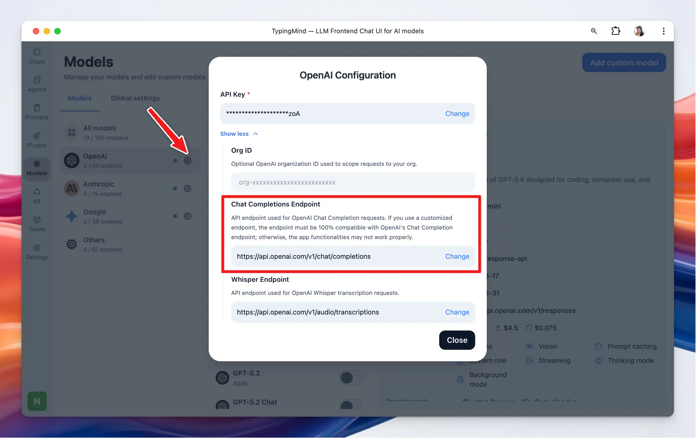

In case you don’t want to send the API requests directly to OpenAI API or Anthropic Claude API due to privacy and security concerns, you can set up a Proxy for these endpoints.

## Access Proxy Setup

- Click on “Models” on the left sidebar to access the model settings
- Click on the gear icon next to each model provider
- Toggle the optional fields

## Set up Proxy

1. **OpenAI Chat Completions Endpoint (V1)**:

Custom proxy for OpenAI Chat Endpoint:

- **Default Endpoint**: `https://api.openai.com/v1/chat/completions`
- **Customize**: if you need to change this endpoint, enter the new URL in the provided field and click **Save**.
1. **Anthropic Chat Completions Endpoint (V1)**:

Custom proxy for Anthropic Chat Endpoint:

- **Default Endpoint**: `https://api.anthropic.com/v1/messages`
- **Customize**: enter a new URL if your setup requires a different endpoint, then click **Save**.
1. **Google Gemini Endpoint**

Custom proxy for Google Gemini Chat Endpoint:

- **Default Endpoint**: `https://generativelanguage.googleapis.com/v1beta/models`
- **Customize**: enter a new URL if your setup requires a different endpoint, then click **Save**.
1. **OpenAI Whisper Endpoint (V1)**:

This option allows you to set up your local whisper for voice input:

- **Default Endpoint**: `https://api.openai.com/v1/audio/transcriptions`
- **Customizing**: Input a different URL if necessary and click **Save**.