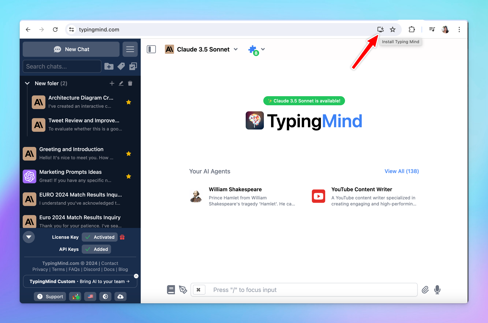

TypingMind offers a flexible option where you can install the app as PWA on every platform from MacOS, Windows, Linux, to Android, iOS. 

You will need to access to [typingmind.com](http://typingmind.com) first then Install or Add to homescreen as follows:

### On desktop

Here’s how you can add PWA on desktop:

### On mobile

Here’s how you can add PWA on mobile:

By adding TypingMind as PWA, you will see the TypingMind icon right on your homescreen or desktop so you can easily click on and get started.