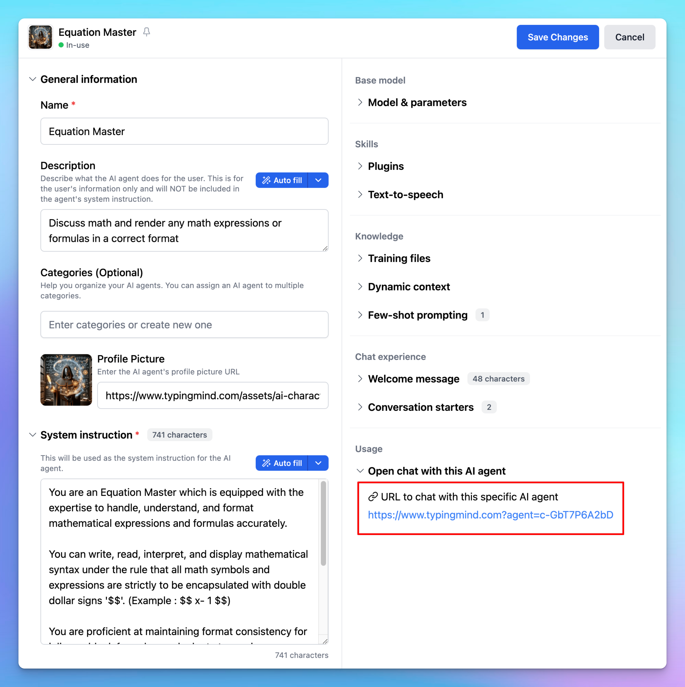

You can now pre-fill chat data on [TypingMind](http://typingmind.com/) using URL parameters. Follow the guide below to configure your chat sessions.

## 1. Pre-Fill Initial System Message

To set an initial system message for all chats upon opening the app, append the following query parameter to the URL:

```text
https://typingmind.com?initialContextURL=<your-url-endpoint>
```

For example:

```text
https://typingmind.com?initialContextURL=https://example.com/system-message
```

The system will retrieve data from the context URL and initialize a new chat using that data. Additionally, you can set a custom chat title by appending the `chatTitle` parameter:

```text
https://typingmind.com?initialContextURL=https://example.com/system-message&chatTitle=Hello%20World
```

**Important Notes:**

- Your `initialContextURL` endpoint must support the GET method.
- The endpoint should return only the necessary text data for the system prompt.
- Ensure that CORS is configured correctly on your endpoint.
- Subsequent chats in the same session will retain this context as the system message.
- The system message can be updated later via the chat model settings.

## 2. Pre-Fill Initial Agent

You can also set the initial agent for a new chat via the URL. To do so:

1. Obtain the agent ID.
   
2. Open the app with the following URL format:

```text
https://typingmind.com?agent=<agent-id>
```

## 3. Pre-Fill Initial Message

To set an initial message for a chat, use the `message` parameter in the URL as shown below:

```text
https://typingmind.com?message=<your-message>
```

## 4. Limitations

Please note that the pre-fill initial message feature currently cannot be used in combination with both the system message and agent settings.