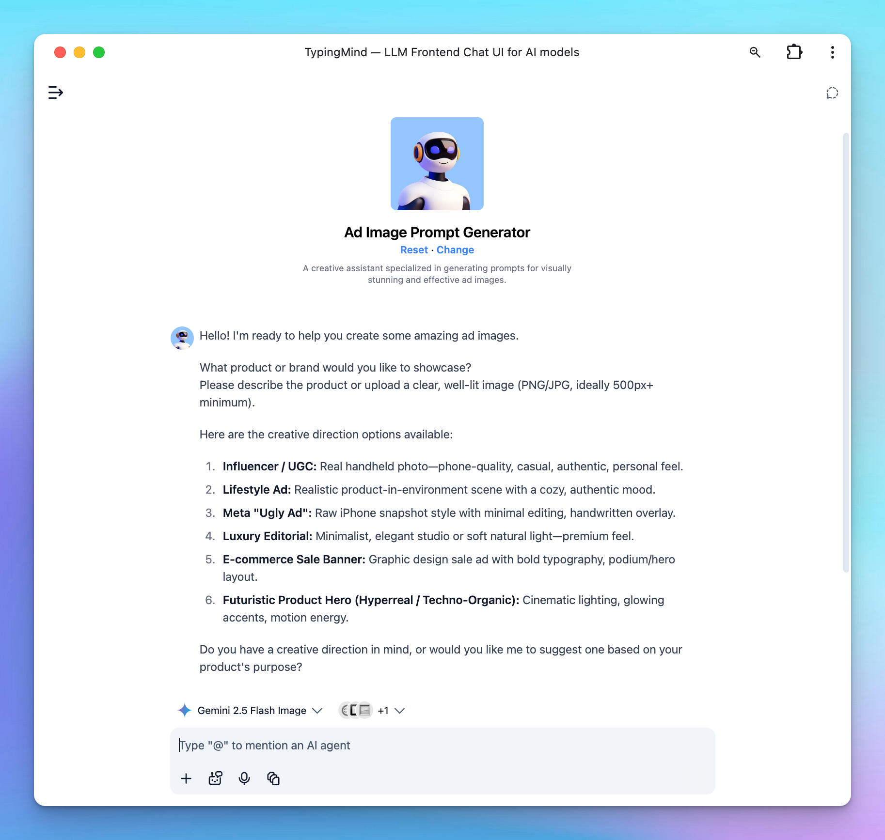

# Ad Creative Generator

Creating strong ad visuals isn’t just about using AI - it’s about giving AI the right instructions.

Many e-commerce owners try image generators and end up disappointed. The visuals look unrealistic, off-brand, or simply not aligned with their campaign goals.

The reason is simple: **your results are only as good as your prompt.**

The prompt is the “creative brief” you give to AI and when done right, it turns a random output into a sales-ready image.

That’s why we built a clear, step-by-step **AI Agent** designed specifically for e-commerce to help you generate image prompt that match your purpose, your product, and your brand energy so the AI can generate properly.

## Why E-commerce Stores Struggle with AI Images

Most e-commerce sellers need one thing: ad visuals that look real and convert.

Instead, AI without proper direction gives you three flavors of failure:

- **Too Polished:** CGI-looking renders that scream "artificial"
- **Too Random:** Props and settings that clash with your brand world
- **Too Generic:** Soulless copycat content with zero story

The problem isn't the tool—it's the missing creative brief between your marketing goal and the AI model.

Our AI Agent closes that gap. Think of it as a **creative director in your pocket**: translating your vision into precise AI prompts that are systematic, brand-true, and engineered to sell.

## Meet the AI Agent for E-commerce to Help Generate Image Prompts

This AI Agent helps you turn your product photo or expectation into a complete, ready-to-generate image prompt.

Here’s how it works:

1. **Discover your product + creative direction:** upload your product photo (or describe it) and pick a visual style that fits your campaign goal.
2. **Explore your goals:** explore your goals or image expectations further to generate proper image prompt for AI.
3. **Generate your ad prompt: y**ou’ll get a detailed text prompt describing how your image should look: mood, setting, composition, and overlay text.
4. **Refine & approve: r**eview the result, tweak the mood or tone, and then generate your image.

## Ad Image Prompt Generator AI Agent: How It Works

### 1. Upload your photo and choose a creative direction

Here are the creative direction options available:

1. **Influencer / UGC:** Real handheld photo—phone-quality, casual, authentic, personal feel.
2. **Lifestyle Ad:** Realistic product-in-environment scene with a cozy, authentic mood.
3. **Meta "Ugly Ad":** Raw iPhone snapshot style with minimal editing, handwritten overlay.
4. **Luxury Editorial:** Minimalist, elegant studio or soft natural light—premium feel.
5. **E-commerce Sale Banner:** Graphic design sale ad with bold typography, podium/hero layout.
6. **Futuristic Product Hero (Hyperreal / Techno-Organic):** Cinematic lighting, glowing accents, motion energy.
7. **Infographic:** Clean, informative layout that visualizes key features or data with icons, concise text, and clear structure—ideal for explaining or comparing product benefits.

### 2. Share with the AI model your expectation

Based on your chosen creative direction, the AI will ask follow-up questions about the setting, mood, environment, and any text overlay you’d like to include in the image.

### 3. Generate an image prompt

<aside>
💡

We use **Gemini 2.5 Flash Image** (also known as *Nano Banana*) as the core model for this AI Agent to ensure high-quality, realistic image results.

For generating the **prompt**, you can start with any model that best fits your workflow or creative style. Once your prompt is finalized, switch to **Gemini 2.5 Flash Image** to produce the final images with better accuracy and visual consistency.

**To get started, i**mport the AI Agent and customize it to fit your needs: [https://cloud.typingmind.com/characters/c-01K9RGKYA6BBBGK1KY5KQAENY3](https://cloud.typingmind.com/characters/c-01K9RGKYA6BBBGK1KY5KQAENY3)

**Note:** This AI Agent doesn’t guarantee a perfect result every time. Treat it as your creative assistant — you may need to **tweak the prompt** or **re-generate** the image until it matches your vision.

</aside>

## Ad Image Prompt Generator AI Agent in action

This is our uploaded product:

Here are the product image in different creative directions:

1. **Influencer/UGC**

1. **Lifestyle**

1. **Meta Ugly Ads**

1. **Luxury editorial**

1. **E-commerce sales banner**

1. **Futuristic Product Hero (Hyperreal / Techno-Organic)**

1. **Infographic style**

## How to Choose the Right Creative Direction

Each creative direction fits a specific goal. Pick the one that matches your campaign:

- **Influencer / UGC:** When you want trust and authenticity. Feels like a real user showing the product in daily life.
- **Lifestyle Ad:** When you want emotion and storytelling. Shows how your product fits naturally into real moments.
- **Meta “Ugly Ad”:** When you want quick conversions. Raw and casual — great for scroll-stopping social ads.
- **Luxury Editorial:** When you want a premium, refined brand image. Perfect for high-end or minimalist products.
- **E-commerce Sale Banner:** When you want to promote offers. Bold, clear design that sells immediately.
- **Futuristic Product Hero:** When you want a strong visual statement. Cinematic, modern, and made to impress.
- **Infographic:** When you want to educate or highlight product benefits clearly. Great for explaining features, comparisons, or how-to visuals.

Choose the direction that fits your goal - and the AI will create visuals that look real, relevant, and ready to sell.

## Final Thought

When you know exactly what kind of image you want, AI becomes a creative partner, not a guessing game.

This prompt system gives e-commerce owners a simple way to guide AI with purpose - so every image looks real, fits your brand, and helps you sell more confidently.