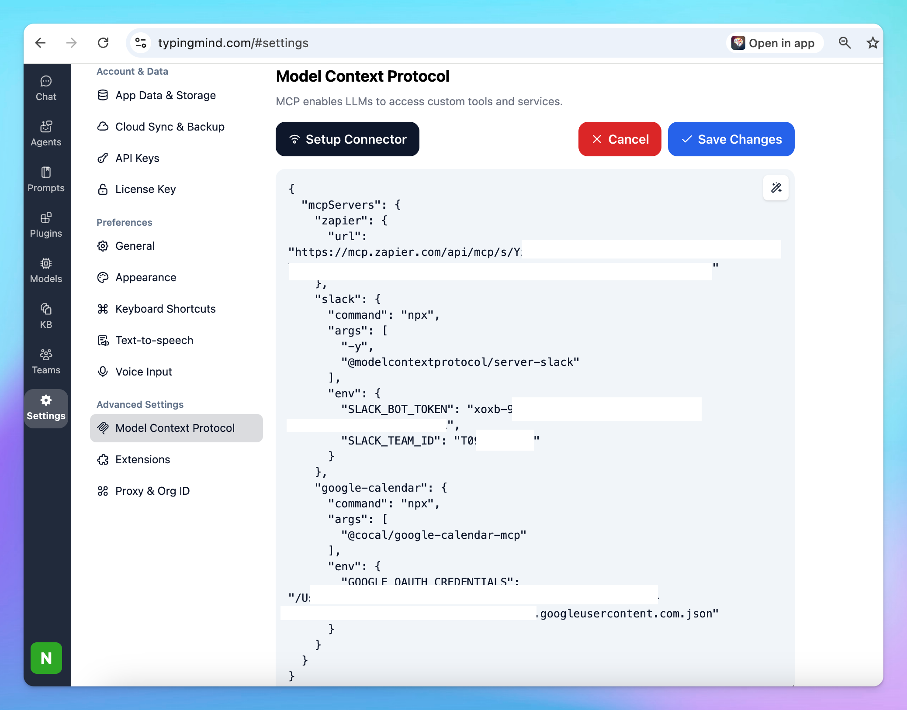

Meetings matter, but handling the details afterward can be tedious. Writing minutes, sharing summaries on Slack, and scheduling the next meeting all take up valuable time.

What if you could automate all of it?

This guide shows you how to set up an AI agent to summarize meetings, send those notes to Slack, and schedule the next meeting in Google Calendar—all automatically.

## Step 1: **Integrate Slack and Google Calendar to TypingMind**

To streamline things, connect your TypingMind to:

- **Slack**: Automatically send meeting notes to any channel you choose.
- **Google Calendar**: Book your next meeting right from the same workflow.

The AI assistant on TypingMind will help summarize your meeting and takes care of the follow-up, so your team stays updated with zero manual effort.

<aside>
💡

Connect TypingMind to these apps via MCP:

- You can both connect the two apps via [Zapier MCP](../Model%20Context%20Protocol%20(MCP)%20in%20TypingMind/TypingMind%20MCP%20+%20Zapier%2023b7c3f1757a8006affbd0af883d320f.md)
- Or set them up separately via their MCP servers:
    - [Set up Slack MCP on TypingMind](../Model%20Context%20Protocol%20(MCP)%20in%20TypingMind/TypingMind%20MCP%20+%20Slack%202957c3f1757a802ba3f7fc9a542c9908.md)
    - Set up Google Calendar on TypingMind (setup guide coming soon, refer to [Google Calendar MCP](https://github.com/nspady/google-calendar-mcp) for more details)
</aside>




## Step 2: Build an AI Agent for Meeting Summaries

Now, time to create an AI agent that helps pull out key points from your meeting transcript. Here’s a simple structure:

- **Attendees**: List everyone who joined, with their roles and departments.
- **Discussion Points**: Sum up the main topics and any different viewpoints.
- **Decisions Made**: Note each decision, who made it, and why.
- **Action Items**: Assign tasks, name who’s responsible, and set deadlines.
- **Data & Insights**: Highlight key numbers or facts that shaped decisions.
- **Follow-Up**: Record any plans for the next meeting or checkpoints.

Example instruction for AI Agent:

```json
You are an expert meeting summarizer. Analyze the provided meeting transcript and produce clear, structured, and actionable meeting minutes.

Your output should follow this format and tone: professional, concise, and ready to share with a team. Use bullet points where appropriate.

## 📋 Attendees
List all participants along with their **roles** and **departments**.  
If not explicitly stated, infer based on context.

## 🗣️ Discussion Points
Summarize all **key topics** discussed.  
Include major viewpoints, debates, and unresolved questions.

## ✅ Decisions Made
Record all **decisions**, specifying:
- What was decided  
- Who made the decision  
- The rationale or supporting data

## 📌 Action Items
List all follow-up tasks in a clear, actionable format:
- **Task / Deliverable**
- **Responsible Person or Team**
- **Deadline**
- **Dependencies or Notes**

## 📊 Data & Insights
Highlight any **data, metrics, or insights** that influenced discussions or outcomes.

## 🔄 Follow-Up
Note all **next steps**, including:
- Agreed follow-up meetings or reviews  
- Suggested timelines or checkpoints
- Ask users if they want to schedule the next meeting or not
```


## Step 3: Run the workflow

Here's how to run the workflow:

1. Choose the “Meeting Summarizer” Agent to chat with
2. Upload your recorded meeting to TypingMind to create a transcript, or upload an existing text transcript.
3. The AI Agent will help turn the transcript into detailed minutes.


1. Send the meeting minutes to your team in Slack and schedule next checkpoint automatically:

