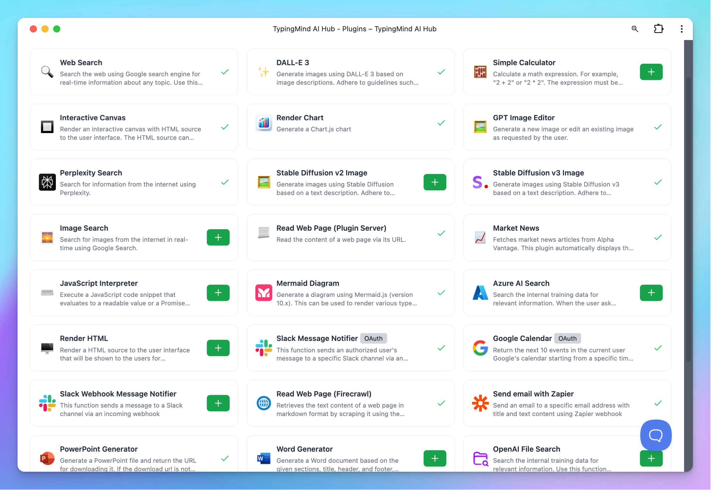

With TypingMind, every conversation with AI can launch workflows, update CRMs, resolve support tickets, publish content, or trigger reports — all automatically, across the tools you already use.

## Why Businesses Automate with TypingMind

- **Save hours** by cutting repetitive steps out of daily operations.
- **Connect familiar platforms** like Salesforce, HubSpot, Zendesk, Slack, and Google Workspace.
- **Scale workflows** from personal productivity to team‑wide automation.
- **Stay flexible** with an API and integrations that adapt to your stack.

## Core Capabilities for Automation on TypingMind

On TypingMind, you can build use our available plugins or build custom plugins to connect directly with the third-party platforms your team already uses. This makes it simple to extend your workflows without leaving the app.

**Use it for:**

- Sending **Slack messages**
- Querying **databases**
- Updating **support tickets**
- Generating **images**
- Rendering **charts & visualizations**

**Impact:** Seamless integrations that bring your external tools into TypingMind → fewer context switches, faster workflows, and more powerful automations.

<aside>
💡

More information about plugin: [https://docs.typingmind.com/plugins](https://docs.typingmind.com/plugins)

</aside>

How to implement plugins:

You can create plugins using one of the following methods:

- [**JavaScript code**](https://docs.typingmind.com/plugins/build-a-typingmind-plugin) — write custom logic directly.
- [**HTTP action**](https://docs.typingmind.com/plugins/build-a-typingmind-plugin) — connect to external APIs and services.
- [**Model Context Protocols (MCP)**](https://docs.typingmind.com/model-context-protocol-(mcp)-in-typingmind) — integrate structured data and actions into your AI workflows.

## Example Automation Flows You Can Run on TypingMind Chat

### 1. Customer Support

- A customer submits a ticket via **Intercom** (connected with TypingMind).
- The support agent interacts with AI through the **TypingMind UI** to manage and organize Intercom tickets.
- The AI automatically labels the ticket within the **TypingMind chat**.
- Notify team in **Slack**
- The customer receives an **instant follow-up response** or an **escalation notice**.

**Impact**: faster response times, reduced agent workload, happier customers.

### 2. Marketing Content Pipeline

- Research trends and competitors using Web Search
- Generate blog draft, optimize for SEO, and create visuals.
- Push the draft straight to **WordPress or HubSpot**.
- Auto‑share finished content to **LinkedIn/Twitter** with tailored captions.

**Impact**: content team moves from idea → publish in a single flow.

### 3. Internal Reporting

- Pull daily metrics from **Google Analytics, BigQuery, or Sheets**.
- AI summarizes insights in natural language.
- Charts are generated automatically.
- Digest is delivered to **Slack or Gmail**.

**Impact**: no more manual dashboards—everyone stays informed automatically.

<aside>
💡

Detailed guidelines on how to implement these workflows and more will be updated soon.

</aside>