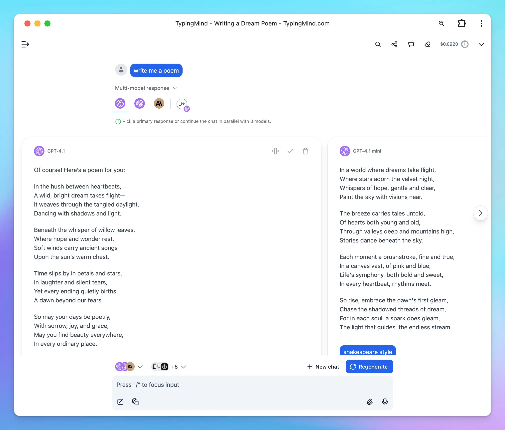

On TypingMind, you can chat with multiple AI models and bring those models to one conversation.

This is especially useful for comparing outputs, evaluating model performance, or gathering diverse perspectives on a prompt.

This guide walks you through how to activate and use the multi-model feature in TypingMind.

## What Is Multi-Model Response?

Multi-model response enables you to run the **same prompt across several AI models simultaneously**. Instead of switching between models manually, you can view how different models—such as GPT-4.1, Claude Sonnet 4, Gemini 2.5 Pro, or others—respond to the same input in TypingMind interface.

## How Multi-Model Works in TypingMind

When you activate multi-model, TypingMind sends your prompt to multiple selected AI models at once. Each model generates its own independent response, allowing you to compare them side by side.

When you ask follow-up questions:

### 1. **Each Model Maintains Its Own Context - Continue Multiple Conversations in Parallel**

TypingMind keeps separate conversation threads for each model. When you send a follow-up prompt, it’s processed by each model **based on its own previous response in parallel:**

This ensures that the conversation with each model remains coherent and contextually accurate.

### 2. Selecting a Primary Response

If you prefer one model's response over the others, you can **select it as the primary response**.

This changes the behavior of follow-up interactions:

- Follow-up questions will use the context of your selected (preferred) response.
- Subsequent prompts will still generate responses from all active models.

### 3. Combine responses and finalize them into one final answer

**We called this Finalize Mode,** which allows you to merge responses from multiple AI models into one final answer. Instead of picking just one model’s reply, you can review all outputs and then finalize a response that best represents the combined insights.

## How to Activate Multi-Model

Follow these steps to enable multi-model responses:

- **Open the Model Selector**

Click on your currently active model (for example, **GPT-4.1**) at the bottom left corner of the TypingMind interface. This will open a list of all available models.

- **Add Additional Models**

In the model list, you’ll see a **“\+” button** next to each model. Hover over it and it will display a tooltip: **“Activate multi-model”**.

Click this button to add the model to your current conversation.

Once added, the model will appear in the active model bar at the bottom, alongside your originally selected model.

- **Manage or Remove Models**

To manage your selected models:

- Click on the model bar (where your selected models are shown)
- Use the “-” button to remove any models

TypingMind will automatically run your next prompt through all selected models and display their responses side by side.

## Use Cases for Multi-Model

- **Prompt testing:** see how each model interprets the same input to refine your prompts.
- **Quality comparison:** determine which model is more accurate, creative, or concise for your needs.
- **Code generation:** compare multiple implementations of the same logic or request code review from different models.
- **Content writing:** explore variations in tone, style, or structure by generating writing samples from multiple models.
- **Creative ideation:** use multiple models to brainstorm ideas, titles, or outlines from different perspectives