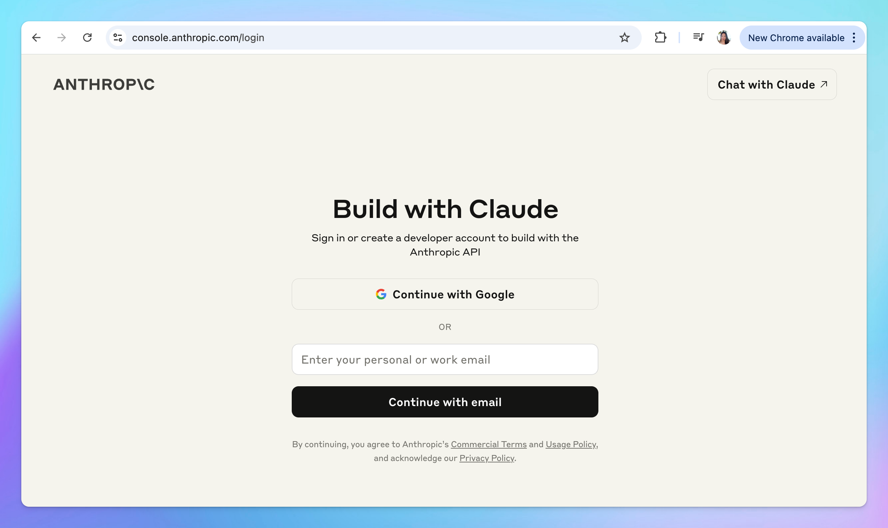

Use Claude models such as Claude Sonnet 4.6, Claude Haiku, Claude Opus on TypingMind via API!

Here’s how to set up on TypingMind.

## Step 1: Create an Anthropic API account

- Create an Anthropic Claude API account at [https://console.anthropic.com/login](https://console.anthropic.com/login)

## Step 2: Top up your API credit

Go to [Billing](https://console.anthropic.com/settings/billing) section to top up your API credit to use the models:

## Step 3: Get your API key

- Create a new API key at [https://console.anthropic.com/settings/keys](https://console.anthropic.com/settings/keys)
- Copy the key to a safe place

## Step 4: Enter your API key to TypingMind

- Go to [**typingmind.com**](http://typingmind.com)
- Navigate the Models menu on the left sidebar → Switch to API key tab
- Input the copied API key

## Advanced settings

**Custom endpoint:** Use the direct endpoint `https://api.anthropic.com/v1/messages` or configure your own custom chat completions endpoint.

<Info>
  Common issue:

  `“Could not connect to Anthropic API. Please try again later. Error code:400”`

  This issue may appear when your credit balance is too low to access the Claude API. Please check and add your credit balance at [https://console.anthropic.com/settings/plans](https://console.anthropic.com/settings/plans), then try again.
</Info>