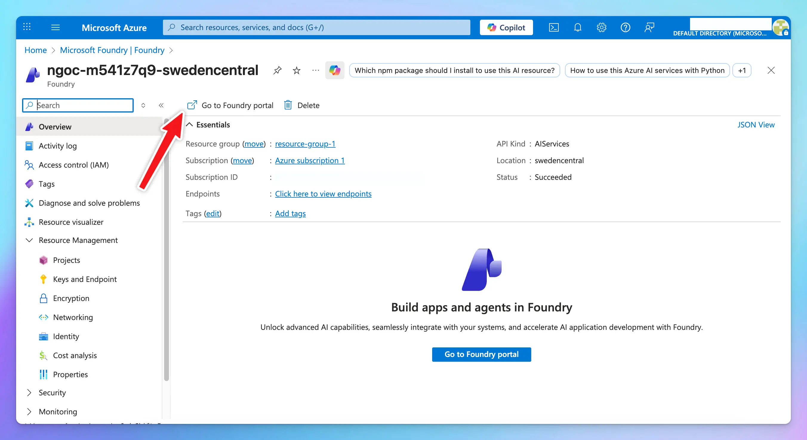

Azure Foundry allows you to deploy and run Anthropic (Claude) models using Azure’s infrastructure. After deploying the model in Azure, you can connect it to TypingMind using the Claude Message API format.

Follow the steps below to set up your Claude model on Azure and integrate it into TypingMind.

## **Step 1: Add the model on Azure**

1. Log in to [**https://portal.azure.com**](https://portal.azure.com/) and select **Foundry**.
2. Choose your resource and open the **Foundry Portal**.

3. Go to **Model Catalog** → select a **Claude** model → click **Use this model**.

4. **Deploy** the model.

5. Open the deployment in **Playground** → click **View code**.

6. Switch to the **Key authentication** tab → switch to **cURL** to view the code sample.

From here, copy the following values:

- **Endpoint**
- **Anthropic API version**
- **Model ID**
- **API key**

## Step 2: Set up on TypingMind

Go to **Models → Add Custom Models**

Enter the following information:

- **Name:** Claude via Azure
- **API type:** switch to **Claude Message API**
- **Endpoint:** paste the endpoint you copied in Step 1
  - Format example: `https://[RESOURCE-NAME].openai.azure.com/anthropic/v1/messages`
- **Model ID:** your copied model ID
- **Add Custom Headers:**
  - `x-api-key: your-copied-api-key`
  - `anthropic-version: your-copied-anthropic-version`

