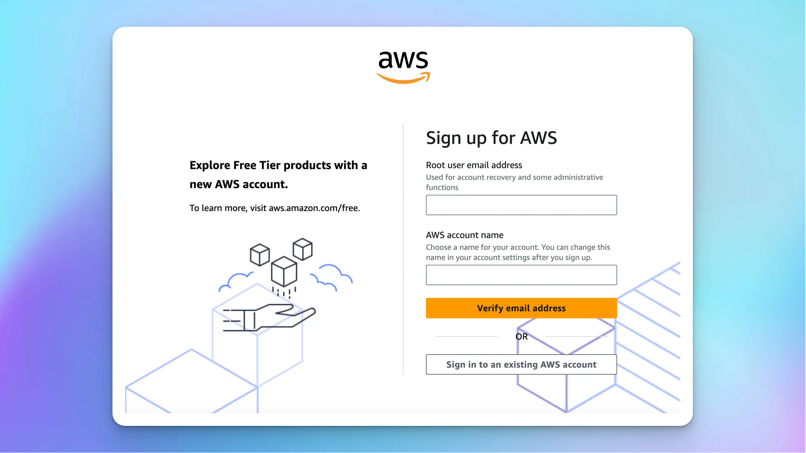

You can use AWS Bedrock Claude models on TypingMind Custom by adding a Custom Model using the following steps:

<Note>
  This feature is currently only available for **TypingMind Custom Admin** users. We are actively working on updates to make it accessible to all users soon!
</Note>

# 1. Create an AWS account

If you do not have an account yet, register for an AWS account here: [https://signin.aws.amazon.com/signup?request\_type=register](https://signin.aws.amazon.com/signup?request_type=register)

Once you complete signup, move to the next steps.

# 2. Request Bedrock Claude models

- Search for the "Bedrock" service on the Navigation bar and click on “Amazon Beckrock”

- Click “Get Started” under the Try Bedrock rection

- Select Base Models and hover to the Claude models you want to access → click “Model Access”

- Click on “Available to request” and there’s a popup that will prompt you to Request model access.

- Click on that and select the Anthropic models you want to access → click “Next”  → click “Submit” to submit the model request access. It might take a few minutes to get approved and access to the chosen models.

<aside>
  📌

  Please check your model quotas to know your limits. If your region is `us-east-1`, you can check it here: [https://us-east-1.console.aws.amazon.com/servicequotas/home/services/bedrock/quotas?region=us-east-1](https://us-east-1.console.aws.amazon.com/servicequotas/home/services/bedrock/quotas?region=us-east-1)
</aside>

# 3. Create access and secret keys

- Search for “IAM” service on the search bar
- Click on Users right below the IAM service to navigate to the User Groups page.

- Click on “Create user” to create a new user with the Bedrock permissions.

- Enter the username and click “Next”

- Within the Set Permission options, select “Attach policies directly”
- Within the Permission policies, search for Bedrock and select all the polices → Click Next

- Click “Create user” to create a new user.
- After completing creating a new user, click on that user to navigate to the new user's details page and generate access and secret keys.

- Click “Create access key”

- Within the Access key best practices and alternatives section, select “Application running outside AWS” and click Next

- Click on “Create access key” to have the access key and secret access key.

- Store these access key and secret access key along with the AWS region. Also go back to the Base models page and navigate the Claude model id to copy. We will use this information to create custom model on TypingMind.

# 4. Create a custom model on TypingMind

Access your [Admin Panel](https://custom.typingmind.com/manage), navigate to the Models page, and create a new custom model.

Fill in all required information as follows:

- API Type: Switch to Claude via Bedrock
- Name: give it any name you want, for example, Bedrock Haiku
- Model ID: provide the copied model ID in step 3, for example, `anthropic.claude-3-haiku-20240307-v1:0`
- Content length: can set up to 200k tokens
- Click Add Custom Headers and add the following info:
  - `awsAccesskey` : `your_access_key` (copied in step 3)
  - `awsSecretkey` : `your_secret_access_key` (copied in step 3)
  - `awsRegion` : `your_aws_region` (for example: ap-southeast-2)

- After complete filling all the necessary details, click “Test” and click “Add Model”

# 5. Chat with the new model

