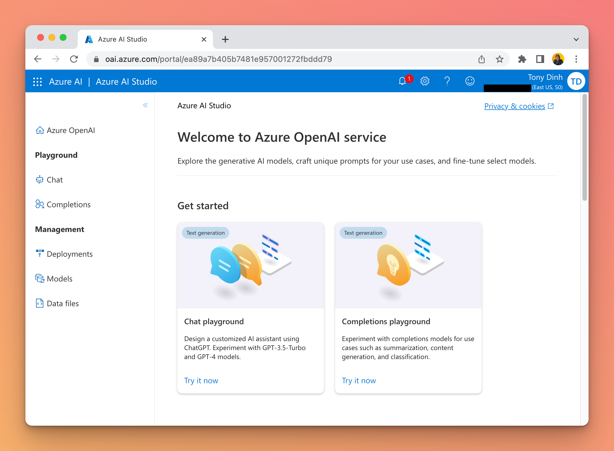

You can use Azure OpenAI on TypingMind by adding a Custom Model as follow:

## Get an Azure OpenAI account

If you haven’t already, you must register for an Azure OpenAI Account. You can create one here: [https://oai.azure.com/](https://oai.azure.com/)

## Get a Deployment, Endpoint, and API Key

Go to “Deployments” and create a new deployment with a model of your choice.

Go to the “Chat” playground and click “View Code” to get your **Endpoint** and **Key**.

## Create a custom model on TypingMind

Go to [typingmind.com](http://typingmind.com) and create a new Custom Model as follow:

- Click Add Custom Model
- Enter any name.
- Enter the exact endpoint (including the `?apiVersion` part).
- **Important: there are many types of endpoint on Azure OpenAI. Make sure you use the correct one that contains “/chats/completions”.**
- Enter the Model ID and context length
- Add a custom header row, then enter `api-key` and the API key in the value textbox.

- Click “Test” and verify that the endpoint is working.
- Click “Add Model”.

## Chat with Azure OpenAI

You can now select the Azure OpenAI model and chat with it.

