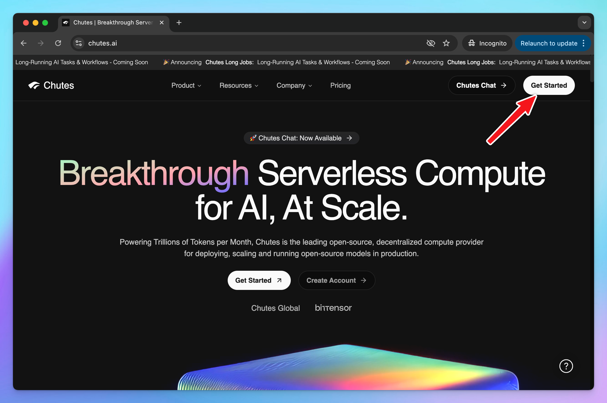

# Chutes AI

Chutes is the leading open-source, decentralized compute provider for deploying, scaling and running open-source models in production.

This guide will walk you through connecting your Chutes AI models to TypingMind using a custom model setup.

## Step 1: Set up Chutes AI account

- Sign up for a Chutes AI account at [https://chutes.ai/](https://chutes.ai/)

- To use models via Chutes, you need to access to [https://chutes.ai/app/api/billing-balance](https://chutes.ai/app/api/billing-balance) to:
    - Top up API credits
    - or Subscribe to a Chutes subscription

## Step 2: Get Chutes API key

Go to [https://chutes.ai/app/api](https://chutes.ai/app/api) to create an API key:

Copy your API key and keep it in a secure place - you will need it in the next step.

## Step 3: Set up custom model on TypingMind

1. Open TypingMind
2. Go to **Models → Add Custom Model**

Fill in the following fields:

- **Name:** Chutes AI (or any name you prefer)
- **Endpoint:** *(enter your Chutes model endpoint)*
- **Model ID:** for example, `deepseek-ai/DeepSeek-R1-0528` , `Qwen/Qwen2.5-Coder-32B-Instruct`. You can explore more models at [**https://chutes.ai/app**](https://chutes.ai/app)
- **Custom Header:**
    - `Authentication: Bearer YOUR_API_KEY`

Replace **YOUR_API_KEY** with the key you copied in Step 2.

## Step 4: Start chatting!

