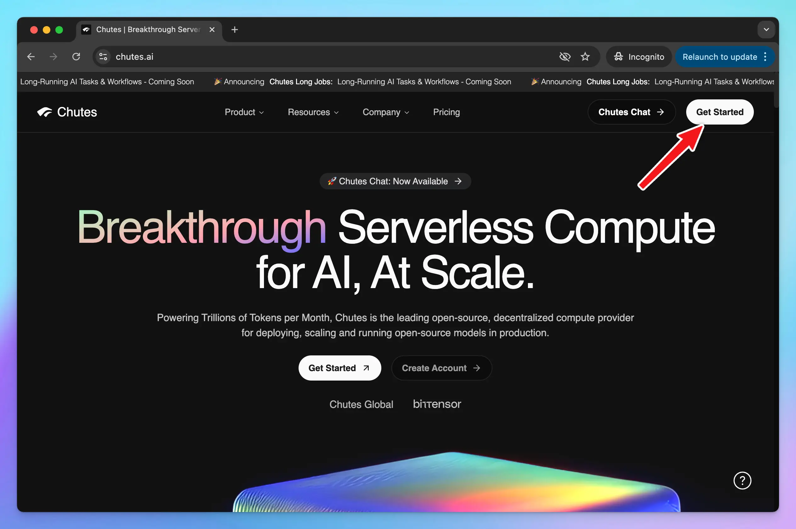

Chutes is the leading open-source, decentralized compute provider for deploying, scaling and running open-source models in production.

This guide will walk you through connecting your Chutes AI models to TypingMind!

## Step 1: Set up Chutes AI account

- Sign up for a Chutes AI account at [https://chutes.ai/](https://chutes.ai/)

- To use models via Chutes, you need to access to [https://chutes.ai/app/api/billing-balance](https://chutes.ai/app/api/billing-balance) to:
  - Top up API credits
  - or Subscribe to a Chutes subscription

## Step 2: Get Chutes API key

Go to [https://chutes.ai/app/api](https://chutes.ai/app/api) to create an API key:

Copy your API key and keep it in a secure place - you will need it in the next step.

## Step 3: Use Chutes AI models on TypingMind

### 1. Use available Chutes AI models 

- Go to [typingmind.com](http://typingmind.com) 
- Go to Models → Switch to API keys tab and enter the API key for Chutes

<Frame>
  
</Frame>

After that, switch back to Models tab → Select Chutes and enable the models you want to chat with.

<Frame>
  
</Frame>

### 2. Use Chutes AI models as custom models

This is usually helpful when a new model is released and the app has not been updated yet.

1. Open TypingMind
2. Go to **Models → Add Custom Model**

Fill in the following fields:

- **Name:** Chutes AI (or any name you prefer)
- **Endpoint:** _(enter your Chutes model endpoint)_
- **Model ID:** for example, `deepseek-ai/DeepSeek-R1-0528` , `Qwen/Qwen2.5-Coder-32B-Instruct`. You can explore more models at [**https://chutes.ai/app**](https://chutes.ai/app)
- **Custom Header:**
  - `Authentication: Bearer YOUR_API_KEY`

Replace **YOUR\_API\_KEY** with the key you copied in Step 2.

## Step 4: Start chatting!

