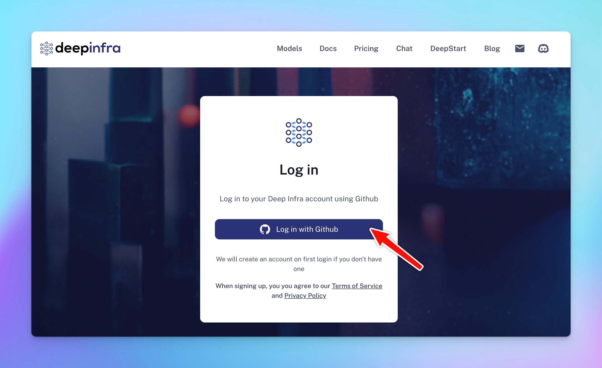

DeepInfra allows you to access Open-source AI models such as Meta LLaMA 3, Mistral AI, Gemma, etc. at low cost.

Here’s how to set up DeepInfra on TypingMind

## Step 1: Create DeepInfra account

Go to [https://deepinfra.com/](https://deepinfra.com/) and Log into DeepInfra via your GitHub account

## Step 2: Generate an API key

- Go to DeepInfra API Key page at [https://deepinfra.com/dash/api\_keys](https://deepinfra.com/dash/api_keys)
- Click on “**New API Key**”
- Enter your API Key Name and click “**Generate API Key**”

- Copy the generated API key and move to step 3

## Step 3: Use DeepInfra on TypingMind

- Go to [**typingmind.com**](http://typingmind.com)
- Navigate the Models menu on the left sidebar → Switch to API key tab
- Input the copied API key for DeepInfra.

<Frame>
  
</Frame>

After entering the API key for DeepInfra, switch back to Models tab → select DeepInfra → enable DeepInfra models you want to chat with.

<Frame>
  
</Frame>

## Step 4: Start chatting!

Now, you can choose the model and interact with it! Below is an example chat with LLaMA 3 70b:

