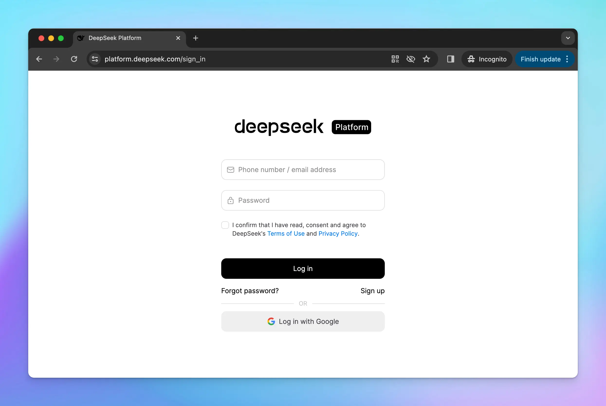

Detailed guide on how to use DeepSeek AI on TypingMind.

<iframe src="https://www.youtube.com/embed/nxl8NkS2v5c" title="YouTube video player" frameborder="0" className="w-full aspect-video rounded-xl" allow="accelerometer; autoplay; clipboard-write; encrypted-media; gyroscope; picture-in-picture; web-share" allowfullscreen />

## Step 1: Sign up for DeepSeek AI

First, you will need to sign up for a DeepSeek AI account at [https://platform.deepseek.com/sign\_in](https://platform.deepseek.com/sign_in)

## Step 2: Get DeepSeek API key

- Go to [https://platform.deepseek.com/api\_keys](https://platform.deepseek.com/api_keys)
- Create a new API key
- Copy the generated API key

## Step 3: Set up DeepSeek AI on TypingMind

- Go to Manage Models
- Add Custom Models
- Updates the following information to set up DeepSeek:
  - **Name**: DeepSeek (or you can give it any name you want)
  - **Endpoint**: [`https://api.deepseek.com/v1/chat/completions`](https://api.deepseek.com/v1/chat/completions)
  - **Model ID**: `deepseek-chat` (deepseek-v3.2 without thinking) or `deepseek-reasoner` (deepseek-v3.2 with thinking mode)
  - **Add Custom Headers**: `Authorization`: `Bearer {{YOUR_API_KEY}}` (enter the copied API key)

- Click Test
- Click Update model

Now, you can choose the model and interact with it!