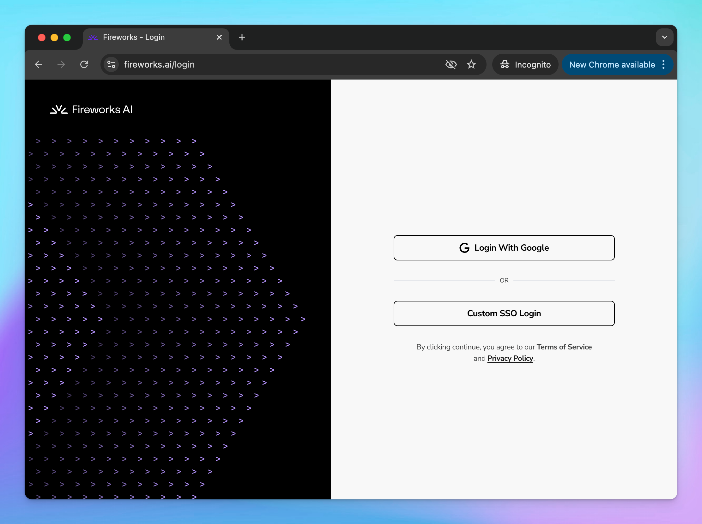

# Fireworks AI

You can integrate AI models from **Fireworks AI** into **TypingMind.** This guide provides step-by-step instructions to help you set up and use Fireworks AI models within TypingMind seamlessly.

## Step 1: Sign up for a Fireworks AI account

To use Fireworks AI models with TypingMind, you first need to create an account with Fireworks AI at [https://fireworks.ai/login](https://fireworks.ai/login).

## Step 2: Get the API key

To connect Fireworks AI with TypingMind, you need an API key for authentication. Follow these steps to generate your API key:

1. Go to [**Fireworks AI API Keys**](https://fireworks.ai/account/api-keys) in your Fireworks AI dashboard.
2. Click the **"Create API Key"** button to generate a new API key.
3. After generating the key, copy it and store it in a **secure location**. You will need this key when setting up the model in TypingMind.

## Step 3: Set up custom model on TypingMind

Once you have your Fireworks AI API key, you need to configure a **custom model** in TypingMind. This process allows TypingMind to connect with Fireworks AI and use its models for generating responses.

1. Open **TypingMind** and navigate to **Models → Add Custom Models**.
2. Enter the following details in the respective fields:
    - **Endpoint:** `https://api.fireworks.ai/inference/v1/chat/completions`
    - **Model ID:**
        - Example: `accounts/fireworks/models/llama-v3p1-405b-instruct`
        - You can find a list of available models here: [**Fireworks AI Model Library**](https://fireworks.ai/models)

<aside>
💡

Important notes: 

- Some models in the **Fireworks AI library** require **manual deployment** before they can be used. This applies to models **without serverless support**.
</aside>

- Under the **Custom Headers** section, add the following:

**Authorization:** `Bearer Your_API_Key`

- Click Test and Add Custom model

## Step 4: Start a conversation!

Once your custom model is successfully configured, you can start using Fireworks AI within TypingMind.

